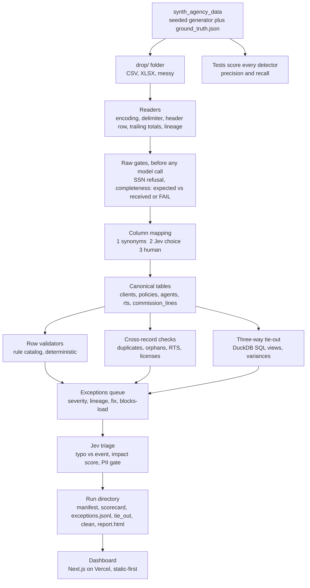

# Build Guide: agency-intake-kit

Step-by-step instructions for building Project 3 of the Agency Data Trust Series with Claude Code (Opus 5.5), then a final sweep with Fable. Companion to `ROADMAP.md`, which carries the why. This file carries the how.

Read in full before the first session. Then work it top to bottom: Step 1 once, Step 2 once, Steps 3 to 5 once per PR, then the Fable sweep.

Last updated: 2026-10-04.

---

## 0. How to use this file

- **One PR per session per worktree.** Never carry two PRs in one context. When a PR merges, the session ends.
- **Prompts are meant to be pasted.** Every block marked `PROMPT` is ready to paste into Claude Code with the bracketed parts filled in. Keep the wording; it encodes the guardrails.
- **The checks enforce themselves.** After Step 1, `npm run verify` is the one command that must pass, and the Stop hook runs it whenever Claude tries to end a turn with uncommitted changes.
- **Alex's rules apply throughout.** Subagents for investigation. Context under 40 percent, `/clear` after two failed corrections. Fresh eyes for review, never the model that wrote the code as the only reviewer. Success defined by concrete examples including what must be blocked. Plain language, no em dashes in any doc or UI string.
- **Scope is the PR plan in section 4.** New ideas become GitHub Issues, not scope creep inside a PR.
- **Both files live in the repo.** Commit `ROADMAP.md` and this file at the repo root in PR 0. The prompts below reference them by name, and every fresh session should start by reading CLAUDE.md, then SPEC.md, then the section of this guide for the current PR.

Glossary for anyone new to the domain, kept short because each README repeats it: a **book of business (BoB)** is the list of clients and policies an agency services. **RTS (ready to sell)** means a broker is licensed, appointed with a carrier, and certified for a plan year in a state. **NPN** is the National Producer Number, a broker's national ID. **MBI** is the Medicare Beneficiary Identifier on a Medicare card. A **carrier commission statement** is the monthly file a carrier sends listing what it paid the agency per policy. A **three-way tie-out** proves that the book, the carrier statements, and the CRM agree with each other.

---

## 1. What we are building

### 1.1 In one paragraph

A command-line pipeline plus a dashboard. You point it at a folder of files a newly acquired agency handed over (a CRM export, an enrollment-platform export, carrier commission statements, an agent roster with ready-to-sell status). It sniffs and reads each file, maps the columns to one canonical schema (dictionary first, Jev second, human third), validates every row against a catalog of deterministic rules, runs cross-record checks (duplicates, orphans, RTS compliance), reconciles the book three ways against the carrier statements and the CRM in DuckDB SQL, triages every exception (deterministic severity, Jev for typo-versus-real-event and a PII gate), asserts completeness, and writes an immutable run directory with a scorecard, an exceptions queue, tie-out variances, clean load files, and a static report. The Next.js dashboard renders that run so an agency owner can see integration health at a glance. All data is synthetic, generated by a seeded generator that also emits ground truth so every detector is scored.

### 1.2 Architecture



### 1.3 Repository layout

```
agency-intake-kit/
  README.md                      the recruiting artifact, follows the README standard
  ROADMAP.md                     copy of the series roadmap
  SPEC.md                        written in Step 2, the contract for every PR
  CLAUDE.md                      commands, gotchas, invariants (short)
  CHANGELOG.md                   one entry per PR
  LICENSE                        MIT
  package.json                   root scripts: verify, demo, shots
  .env.example                   JEV_MODE=replay, TYPESAFE_API_KEY=, ANTHROPIC_API_KEY=
  .gitignore                     .env, runs/*, node_modules, .venv, dashboard/.next, dashboard/public/demo-run is committed
  .claude/settings.json          permissions and the Stop hook
  .claude/hooks/stop-verify.sh   runs npm run verify when stopping with uncommitted changes
  .github/workflows/verify.yml   CI runs npm run verify on push and PR
  engine/                        Python 3.12, uv
    pyproject.toml
    src/agency_schema/           pydantic models, enums, lineage, format helpers, ExceptionRecord, rule registry skeleton
    src/synth_agency_data/       generator, injectors, source writers, ground truth
    src/jev_client/              typed client, modes live/replay/record/off, cassettes, cost guard
    src/intake/
      config.py                  every threshold and tolerance, required fields per table
      readers/                   csv.py, xlsx.py, sniff.py
      gates/                     refusal.py (SSN-001), completeness.py (CMP-001, CMP-002); run on raw frames before any model call
      mapping/                   synonyms.py, jev_mapping.py, enums.py, store.py
      rules/                     dob.py, ids.py, address.py, contact.py, dates.py, status.py
      checks/                    duplicates.py, references.py, rts.py, licenses.py
      tieout/                    load.py, views.py, variances.py, sql/*.sql
      exceptions/                policy.py, triage.py, pii.py
      run/                       orchestrator.py, manifest.py, scorecard.py, writers.py
      report/                    html.py, templates/report.html.j2
      cli.py                     typer app: intake run, intake report, intake diff, intake schema, intake rules
    tests/
      unit/                      one file per module
      e2e/                       full run on fixtures/agency-a
      cassettes/                 recorded Jev responses keyed by request hash
    bench/                       header_mapping.py, results.md
  dashboard/                     Next.js App Router, TypeScript
    app/                         (overview)/page.tsx, sources/, exceptions/, tie-out/, agents/, runs/
    components/                  ui/ (shadcn), tiles, tables, severity-badge, lineage-drawer
    lib/                         run-loader.ts, types.ts (generated from engine JSON schema), format.ts
    public/demo-run/             committed output of npm run demo
    e2e/shots.spec.ts            Playwright screenshots at 1440 and 375, light and dark
  fixtures/
    agency-a/                    seed 42, default mess, committed (small)
      drop/                      the four source files
      ground_truth.json
    agency-a-truncated/          CRM file cut short, tests CMP-001
    agency-a-ssn/                has an SSN column, tests SSN-001
  docs/
    schema.md  rules.md  jev.md  design.md  synthetic-data.md
    adr/0001-duckdb.md  0002-jev-as-gate.md  0003-static-first-dashboard.md  0004-synthetic-only.md
    screenshots/
```

### 1.4 Canonical data model (summary; full field table goes in docs/schema.md in PR 1)

| Table | Key | Fields (abridged) |
|---|---|---|
| clients | client_id | first_name, last_name, dob, phone, email, address_line1, city, state, zip, mbi (nullable), household_id, notes (gated), lineage |
| households | household_id | primary_client_id, members[] |
| agents | npn | first_name, last_name, email, license_states[], upline_npn, status, lineage |
| rts | (npn, carrier, state, plan_year, line_of_business) | appointed, certified, effective_date, end_date (nullable), lineage |
| policies | policy_id | client_id, carrier, plan_id, line_of_business, state (nullable, falls back to the client's address state), eligibility_reason (AGE, DISABILITY, ESRD, or null for ACA), effective_date, termination_date, status, writing_agent_npn, monthly_premium, carrier_member_id, lineage |
| commission_lines | (carrier, statement_period, line_no) | carrier_member_id, member_name, member_dob, policy_ref, agent_npn, amount, commission_type, paid_date, lineage |

`Lineage` on every row: `source_file`, `sheet`, `row_number`, `raw_hash`, `run_id`, `mapping_version`.

`ExceptionRecord` (also in `agency_schema`, because every stage emits them): `id, rule_id, severity, family, source, row_number, raw_hash, field, value_minimized, message, suggested_fix, blocks_load, lane, jev (optional: entry_error_probability, impact_score, pii_probability)`. Never name this class `Exception`; that shadows the Python builtin.

Enums: `LineOfBusiness` {MA, PDP, MEDSUPP, ACA}, `PolicyStatus` {ACTIVE, PENDING, TERMINATED, CANCELLED, UNKNOWN}, `CommissionType` {NEW, RENEWAL, OVERRIDE, CHARGEBACK}, `EligibilityReason` {AGE, DISABILITY, ESRD}. `Carrier` is an open string normalized through a dictionary plus Jev, not an enum.

Format rules encoded as pure functions in `agency_schema.formats` (tested with Hypothesis):
- **MBI**: 11 characters, pattern C A AN N A AN N A A N N, where C is 1 to 9, A is a letter excluding S L O I B Z, AN is a letter (same exclusions) or digit, N is a digit. Position 1 digit 1-9; 2 letter; 3 letter or digit; 4 digit; 5 letter; 6 letter or digit; 7 digit; 8 letter; 9 letter; 10 digit; 11 digit.
- **NPN**: 1 to 10 digits, no leading zero.
- **Medicare contract-plan ID (MA and PDP only)**: `[HRS]\d{4}-\d{3}(-\d{1,3})?`; H and R prefixes are MA (local and regional), S is PDP. Line of business must agree with the prefix. PLN-001 and PLN-003 apply only to MA and PDP policies.
- **Medigap plan letter (MEDSUPP only)**: one of A, B, C, D, F, G, K, L, M, N, optionally prefixed "Plan " or suffixed "High Deductible". PLN-004 applies only to MEDSUPP.
- **HIOS plan ID (ACA)**: `\d{5}[A-Z]{2}\d{7}` optionally followed by `-\d{2}`.
- **ZIP**: 5 digits or 5-4; first three digits must fall in the state's known prefix ranges (table in `agency_schema/data/zip3_state.csv`).
- **State**: two-letter USPS code.

### 1.5 Outputs of a run

```
runs/<run_id>/
  manifest.json       run_id, started_at, finished_at, engine_version, input files with sha256 and row counts,
                      jev mode and usage (calls, tokens, estimated cost), thresholds used, status PASSED | PASSED_WITH_WARNINGS | FAILED
  scorecard.json      rows_in, rows_mapped, rows_clean, exceptions by severity, exceptions by rule, tie-out totals and variances,
                      detection summary against ground_truth if present
  mapping/<source>.yaml   header -> canonical field, method (synonym|jev|human), confidence
  exceptions.jsonl    one per line: id, rule_id, severity, source, row_number, raw_hash, field, value (minimized), message,
                      suggested_fix, blocks_load, jev {typo_probability, impact_score, pii_probability} when present
  tie_out/
    leg_book_vs_statement.json   leg_statement_vs_book.json   leg_crm_vs_statement.json
    variances.json               totals_by_carrier.json       totals_by_agent.json
  clean/
    clients.csv clients.parquet policies.csv policies.parquet agents.csv rts.csv commission_lines.csv (+ .parquet)
  report.html         self-contained, same numbers as the dashboard
```

Blocking policy: a **blocker** stops `clean/` from being written and sets status FAILED. There are exactly three blockers: MAP-003, CMP-001, SSN-001. **Errors** keep their rows out of `clean/` but the run can finish PASSED_WITH_WARNINGS. **Warnings** pass through with a flag column. **Info** is logged only. Runs are immutable: an existing `run_id` is refused unless `--overwrite` is passed, and `--now <iso>` freezes the clock so demo output and screenshots do not churn.

---

## 2. Step 1: Set up the project so the rules enforce themselves (once, about 20 minutes)

Do this in a terminal and one short Claude Code session. Everything here is PR 0 and merges straight to `main`.

### 2.1 Repo, remote, Vercel

```bash
mkdir agency-intake-kit && cd agency-intake-kit
git init -b main
gh repo create agency-intake-kit --public --source=. --remote=origin --description "Agency intake toolkit: validate, reconcile, and dashboard a newly acquired insurance agency's book of business. Synthetic data only."
```

Then in Vercel: New Project, import `agency-intake-kit` from GitHub, set **Root Directory** to `dashboard`, framework Next.js, leave build defaults. Every branch now gets a preview URL and `main` deploys to production. Do not add any environment variables to Vercel; the dashboard never calls Jev or any API.

### 2.2 Scaffold session (Claude Code)

Open Claude Code in the repo and run `/init`, then paste:

```
PROMPT (PR 0, scaffold)

Scaffold this repo exactly per the layout in BUILD-GUIDE-agency-intake-kit.md section 1.3. No feature code yet.

Engine: Python 3.12 managed by uv. Create engine/pyproject.toml with a src layout and four packages: agency_schema, synth_agency_data, jev_client, intake. Dependencies: polars, duckdb, pydantic>=2, typer, rich, httpx, openpyxl, faker, pyyaml, jinja2, charset-normalizer, python-dateutil. Dev: pytest, pytest-cov, hypothesis, ruff, mypy, types-PyYAML. Configure ruff (line length 100, select E F I UP B) and mypy (strict on src, ignore missing imports for openpyxl and faker). Add a console script `intake = intake.cli:app` and `synth = synth_agency_data.cli:app`. Each package gets an __init__.py and one trivial test so pytest runs green.

Dashboard: create-next-app in dashboard/ with TypeScript, App Router, Tailwind, ESLint, src dir off, import alias @/*. Add shadcn/ui init, next-themes, @tanstack/react-table, recharts, lucide-react, vitest + @testing-library/react for unit tests, Playwright for e2e/shots. Add scripts: lint, typecheck (tsc --noEmit), test (vitest run), build, shots (playwright test e2e/shots.spec.ts). One trivial component test so vitest runs green.

Root package.json with scripts:
  "verify": "npm run verify:engine && npm run verify:dashboard"
  "verify:engine": "cd engine && uv run ruff check . && uv run ruff format --check . && uv run mypy src && uv run pytest -q"
  "verify:dashboard": "cd dashboard && npm run lint && npm run typecheck && npm run test && npm run build"
  "demo": "cd engine && uv run intake run --in ../fixtures/agency-a/drop --out ../runs --run-id demo --overwrite --now 2026-10-01T09:00:00Z --jev replay && rm -rf ../dashboard/public/demo-run && cp -r ../runs/demo ../dashboard/public/demo-run"
  "shots": "cd dashboard && npx playwright test e2e/shots.spec.ts"

The root package.json has scripts only and no dependencies, so there is no root lockfile and CI must not run `npm ci` at the root.

Copy ROADMAP.md and BUILD-GUIDE-agency-intake-kit.md into the repo root if they are not already there. Also create: .env.example (JEV_MODE=replay, TYPESAFE_API_KEY=, ANTHROPIC_API_KEY=), .gitignore (.env, runs/*, !runs/.gitkeep, node_modules, .venv, dashboard/.next, dashboard/test-results, __pycache__), LICENSE (MIT, Alexander Munzon, 2026), CHANGELOG.md with a PR 0 entry, empty docs/ and fixtures/ with .gitkeep, .github/workflows/verify.yml that installs uv (astral-sh/setup-uv) and Node 20 with engines pinned to Node 20 in both package.json files, caches both, runs `npm ci` in dashboard only, `uv sync` in engine, then `npm run verify` at the root.

Then write .claude/settings.json and .claude/hooks/stop-verify.sh exactly as given in BUILD-GUIDE section 2.3, and a CLAUDE.md per section 2.4.

Run `npm run verify` and show me the full output. Do not stop until it is green.
```

### 2.3 `.claude/settings.json` and the Stop hook (commit both)

```json
{
  "permissions": {
    "allow": [
      "Bash(npm run:*)", "Bash(npm ci:*)", "Bash(npm install:*)", "Bash(npx playwright:*)", "Bash(npx shadcn:*)",
      "Bash(uv sync:*)", "Bash(uv add:*)", "Bash(uv run:*)",
      "Bash(git status:*)", "Bash(git diff:*)", "Bash(git log:*)", "Bash(git add:*)", "Bash(git commit:*)",
      "Bash(git checkout:*)", "Bash(git switch:*)", "Bash(git worktree:*)", "Bash(git branch:*)",
      "Bash(gh pr view:*)", "Bash(gh pr checks:*)", "Bash(gh pr diff:*)", "Bash(gh issue:*)"
    ],
    "ask": [
      "Bash(git push:*)", "Bash(gh pr create:*)", "Bash(gh pr merge:*)", "Bash(gh release:*)",
      "Bash(vercel:*)", "Bash(rm -rf:*)", "Bash(git reset --hard:*)", "Bash(git rebase:*)",
      "Bash(*--jev live*)", "Bash(*--jev record*)", "Bash(*JEV_MODE=live*)", "Bash(*JEV_MODE=record*)",
      "Edit(.claude/**)", "Edit(.github/**)", "Write(.claude/**)", "Write(.github/**)"
    ],
    "deny": [
      "Read(.env)", "Read(.env.*)", "Read(**/*.pem)", "Read(**/secrets/**)",
      "Bash(git push --force:*)", "Bash(git push -f:*)",
      "Bash(curl:*)", "Bash(wget:*)",
      "Bash(*TYPESAFE_API_KEY=*)", "Bash(*ANTHROPIC_API_KEY=*)",
      "Bash(*echo $TYPESAFE_API_KEY*)", "Bash(printenv:*)"
    ]
  },
  "hooks": {
    "Stop": [
      {
        "hooks": [
          { "type": "command", "command": "bash .claude/hooks/stop-verify.sh", "timeout": 900 }
        ]
      }
    ]
  }
}
```

`.claude/hooks/stop-verify.sh`:

```bash
#!/usr/bin/env bash
# Stop hook: if there are uncommitted changes, run the verify command.
# Exit 2 blocks the stop and feeds the tail of the output back to Claude.
set -uo pipefail
input="$(cat)"
# Avoid loops: if this hook already blocked once this turn, let the stop through.
if printf '%s' "$input" | grep -q '"stop_hook_active": *true'; then
  exit 0
fi
# Nothing to check if the tree is clean.
if [ -z "$(git status --porcelain 2>/dev/null)" ]; then
  exit 0
fi
out="$(npm run verify --silent 2>&1)"
code=$?
if [ "$code" -ne 0 ]; then
  {
    echo "npm run verify FAILED (exit $code). Fix this before stopping. Last 80 lines:"
    printf '%s\n' "$out" | tail -n 80
  } >&2
  exit 2
fi
exit 0
```

`chmod +x .claude/hooks/stop-verify.sh`. Two notes on the permission rules: the `Bash(prefix:*)` form is Claude Code's documented prefix match, so keep the colon. The mid-string wildcards (`Bash(*--jev live*)`, `Bash(*TYPESAFE_API_KEY=*)`) depend on your Claude Code version supporting globs anywhere in the pattern; if yours only supports prefix patterns, drop those lines and rely on `JEV_MODE=replay` being the default in `.env`. And test the Stop hook once on purpose (break a test, ask Claude to stop) so you have seen it refuse before you depend on it. If verify grows past about three minutes, split the hook to run only `verify:engine` or `verify:dashboard` based on which paths changed (`git status --porcelain | grep -q '^.. engine/'`). Keep the full verify in CI regardless.

### 2.4 `CLAUDE.md` (keep it under 60 lines; cut anything Claude would get right without it)

```markdown
# agency-intake-kit

Agency intake toolkit for the Agency Data Trust Series. Synthetic data only. See ROADMAP.md (why) and SPEC.md (what).

## Commands
- `npm run verify`            all checks: ruff, mypy, pytest, eslint, tsc, vitest, next build. Must pass before any commit.
- `npm run demo`              regenerate the committed demo run into dashboard/public/demo-run (uses Jev replay cassettes).
- `npm run shots`             Playwright screenshots to docs/screenshots at 1440 and 375, light and dark.
- `cd engine && uv run intake run --in ../fixtures/agency-a/drop --out ../runs --jev replay`   ground_truth.json is auto-detected as a sibling of drop/, or pass --ground-truth.
- `cd engine && uv run synth generate --seed 42 --clients 2000 --out ../fixtures/agency-a`
- `cd engine && uv run pytest -q tests/unit/test_rules_dob.py -k age`   run one test file or test.

## Invariants (never break these)
- A deterministic verdict is never overridden by Jev or an LLM. Models fill gaps and order queues; rules decide.
- Every output row carries Lineage (source_file, sheet, row_number, raw_hash, run_id, mapping_version).
- Runs are immutable directories. An existing run_id is refused unless --overwrite is passed. Corrections are new rows.
- Raw gates run before any model call: SSN refusal (SSN-001) and completeness (CMP-001, CMP-002) operate on raw frames right after reading.
- Exactly three blockers: MAP-003, CMP-001, SSN-001. Blockers stop clean/ from being written and set FAILED. Errors exclude their rows. Warnings pass with a flag. Info logs only.
- No PHI, no real data, no SSNs. Free text passes the PII gate before any log or model call.
- Thresholds (Jev confidence cutoffs, tie-out tolerances, required fields) live in engine/src/intake/config.py, not inline.
- Jev calls send minimized fields only. Sample values for mapping skip free-text-looking columns and anything matching a 9-digit pattern. Never send notes fields to any model before the PII gate.
- JEV_MODE defaults to replay. live and record spend money and require explicit approval. CI is always replay.
- The exception model is ExceptionRecord in agency_schema. Never name a class Exception.

## Gotchas
- Use uv, not pip. Use polars, not pandas. DuckDB SQL lives in engine/src/intake/tieout/sql/*.sql, loaded by name, never inline strings.
- Readers keep raw values exactly as read. The one exception: cells openpyxl already returns as datetime become ISO strings, because the raw cell was a date. Numeric Excel serials that arrive as text or in CSVs are parsed by the date rules, which accept serials in the 20000 to 60000 range.
- Commission XLSX files have a merged title row and a trailing total row. Header row detection must handle both.
- The CRM export is one row per policy (client fields repeated), so fixtures/agency-a has 2,600 CRM rows, not 2,000.
- Hypothesis tests for MBI, NPN, plan IDs are in tests/unit/test_formats.py; extend them when changing formats.
- Dashboard reads JSON from public/demo-run by default; types in dashboard/lib/types.ts are generated from engine JSON schema by `uv run intake schema --ts`. Regenerate after changing output models.
- Docs and UI strings: plain language, no em dashes.

## Workflow
- One PR per session per worktree. Branch names pr-NN-short-name. Under 400 changed lines.
- Tests first from SPEC examples, then implementation, then `npm run verify`, then show the output.
- Update CHANGELOG.md in every PR.
```

### 2.5 Verify the setup

Checklist before moving on: `npm run verify` green locally; GitHub Actions green on `main`; Vercel shows a deployment for `main` (the default Next page is fine for now); `.env` exists locally with `JEV_MODE=replay` and is ignored by git; the Stop hook fires when you make a trivial breaking change and ask Claude to stop (it should refuse and show the failure).

---

## 3. Step 2: Spec it before any code (new session, no code)

### 3.1 The spec session prompt

Start a fresh Claude Code session in the repo on `main`.

```
PROMPT (spec session)

I want to build agency-intake-kit as described in ROADMAP.md section 5 and BUILD-GUIDE-agency-intake-kit.md section 1. Before any code, interview me with AskUserQuestion, one question at a time, about edge cases, money and data risk, and UX. Cover at least: what blocks a load versus what warns; how column mapping confidence thresholds should behave; what the three-way tie-out must prove and what tolerance is acceptable; what happens when a file is truncated or a source is missing; how Jev is allowed to influence outcomes; what the dashboard's first screen must answer for an agency owner; what is explicitly out of scope. Stop interviewing when you can write the spec without guessing.

Then write SPEC.md with these sections: Business outcome; Users and what each needs to see; Out of scope; Inputs (the four source shapes and their quirks); Canonical schema reference (link docs/schema.md, list tables and keys); Rule catalog reference (link docs/rules.md, list rule families and the blocking policy); Jev usage (the four bounded questions, thresholds, modes); Three-way tie-out definition (each leg, variance reason codes, tolerances); Run outputs (every file and its purpose); Dashboard pages and the one question each answers; Six concrete examples including at least two that must be blocked (seeded in BUILD-GUIDE section 3.3); End-to-end check that proves it works; PR plan (table: PR, name, files, estimated lines, tests, done check) copied from BUILD-GUIDE section 4 and adjusted only where the interview changed something.

Write SPEC.md, then stop. No code.
```

### 3.2 Answers Alex should have ready (so the interview takes ten minutes)

- **Blocking.** Exactly three blockers: required canonical field missing after mapping (MAP-003), completeness failure (CMP-001), SSN column present (SSN-001). RTS-001 (writing agent not ready to sell) is an error, not a blocker, because almost every acquired agency has a few RTS gaps and the run must still produce a load file; the affected policies are excluded and surfaced. Everything else is error, warning, or info per the catalog in section 6.
- **Mapping thresholds.** Jev `choice` confidence at or above 0.85 auto-maps; 0.60 to 0.85 maps but raises MAP-002 for confirmation; below 0.60 stays unmapped (MAP-001). Required fields that are unmapped are MAP-003 blockers. Thresholds live in `config.py`.
- **Tie-out.** Leg A, book versus statement: every active policy in the period should have a commission line (else TIE-001). Leg B, statement versus book: every commission line should match a policy (else TIE-002 orphan payment). Leg C, CRM versus statement: status should agree (else TIE-004). Dollar check: statement amount versus expected from the fixtures rate table within 1 percent or 1 dollar, whichever is larger (else TIE-003); totals by carrier and agent within 0.5 percent (else TIE-005). Matching key is carrier plus carrier_member_id, fallback policy_ref, fallback normalized name plus DOB (flagged as weak match).
- **Truncation and missing sources.** Each source's expected row count comes from a `drop/manifest.json` if the agency provides one (the synthetic writers always emit one, and the truncated fixture keeps the original so the mismatch is detectable), else from the file's own total row (commission statements). Mismatch is CMP-001 blocker. A missing source (no CRM file) is allowed with a warning CMP-002 and the affected tie-out leg is marked NOT_RUN. Both gates run on raw frames before mapping and before any Jev call.
- **Identity mess is injected but not scored here.** The generator injects name typos, nicknames, DOB transpositions, DOB month-day swaps, and near-duplicate clients so the same fixtures serve bob-resolve later, but those defects carry `scored: false` in ground truth and are excluded from project 3's recall gate. Project 3 only flags the exact normalized-name-plus-DOB collisions (DUP-002).
- **Jev's influence.** Only four questions, all bounded: header to canonical field (choice), messy categorical value to enum (choice), exception is a data-entry error rather than a business event (noul), free text contains PII (noul) plus an impact score for queue ordering. Jev never changes a rule verdict or a severity. Jev `off` mode means those four degrade to unresolved and go to the human queue.
- **Dashboard first screen.** "Can this agency go live?" Status banner, rows in versus clean, blockers count, tie-out variance in dollars and policies, RTS gaps, Jev calls and cost, time to run. One screen, no scrolling at 1440.
- **Out of scope.** Real connectors, auth, PHI, commission math beyond the fixtures rate table, employee benefits line of business, LLM-written content in load files, editing data in the dashboard.

### 3.3 The six concrete examples (seed these into SPEC.md; they become tests)

1. **Happy path with mess.** `fixtures/agency-a/drop` (seed 42, 2,000 clients, 2,600 policies, 25 agents, 6 carriers, 3 statement periods, default injectors). Run completes PASSED_WITH_WARNINGS. Scorecard matches ground truth within the tolerances in `tests/e2e/test_agency_a.py`: every scored defect class detected at recall at or above 0.95; false positives on clean rows at or below 0.5 percent; unscored identity defects reported but not gated.
2. **Column mapping with Jev.** The CRM export header `Mbr DOB` with Excel serial values maps to `dob` via synonyms; the header `Birth Dt (mm/dd/yy)` is not in the dictionary, Jev returns `dob` with confidence at or above 0.85 (replay cassette), values parse, zero DOB-001 exceptions on those rows.
3. **RTS error.** Policy P-00417 written by NPN 1884412 for carrier Harborline in TX for plan year 2026; the roster shows no RTS for that combination. RTS-001 fires as an error with suggested fix "obtain RTS or reassign writing agent," the policy is excluded from `clean/policies.csv`, the run still finishes PASSED_WITH_WARNINGS, and the dashboard Agents page shows the gap in the RTS matrix.
4. **Orphan payment.** Harborline statement period 2026-08 line 212 pays 61.05 for carrier_member_id HL-998213, which exists in no policy. TIE-002 fires with the amount; it appears in `tie_out/leg_statement_vs_book.json` and in totals as unexplained revenue.
5. **Must block, truncation.** `fixtures/agency-a-truncated/drop` is identical except the CRM CSV (one row per policy) ends at row 2,574 of 2,600 while `drop/manifest.json` still says 2,600. CMP-001 fires on the raw frame before any mapping or Jev call, status FAILED, `clean/` is not written, `report.html` and the dashboard show a red banner with the expected versus received counts.
6. **Must block, SSN.** `fixtures/agency-a-ssn/drop` adds a column `SSN` to the roster. SSN-001 fires on the raw frame before any model call, status FAILED, and the column's values never appear in any log, exception, or output. The test reads the injected SSN values from `ground_truth.json` and greps the whole run directory for each one, expecting zero hits (a generic 9-digit grep would false-positive on hashes, NPNs, and phones).

### 3.4 Splitting into PRs

The PR plan in section 4 is already under 400 lines per PR. Copy it into SPEC.md. If the interview changes scope, edit the table there; SPEC.md wins over this guide from that point on.

---

## 4. The PR plan

| PR | Name | Main files | Est. lines | Tests | Done when |
|---|---|---|---|---|---|
| 0 | Scaffold | everything in 2.2 | n/a (generated) | trivial | verify green, CI green, Vercel deploys |
| 1 | Canonical schema, formats, exception model, registry skeleton | agency_schema/models.py, enums.py, lineage.py, formats.py, exceptions.py (ExceptionRecord), registry.py (rule decorator, catalog metadata), data/zip3_state.csv, docs/schema.md | 400 | unit + Hypothesis for MBI, NPN, plan IDs, ZIP; registry registers and lists | formats property tests pass; schema JSON exported; every later stage can emit ExceptionRecords |
| 2 | Synthetic clean world | synth_agency_data/world.py, rates.py, canonical_writer.py, cli.py | 380 | determinism by seed, referential integrity, RTS coverage complete | `synth generate` writes clean canonical CSVs plus an empty-defect ground_truth.json |
| 3 | Error injectors and source writers | synth_agency_data/injectors/*.py, writers/*.py (the four source shapes plus drop/manifest.json), docs/synthetic-data.md | 400 | each injector yields labeled defects with scored flag; writers reproduce quirks | fixtures/agency-a, -truncated, -ssn committed |
| 4 | Readers, ingest, raw gates | intake/readers/sniff.py, csv.py, xlsx.py, intake/ingest.py, intake/gates/refusal.py, completeness.py, intake/config.py (first version) | 400 | encoding, delimiter, header row, trailing totals, lineage; SSN-001; CMP-001, CMP-002 | all four fixture files read into raw frames with lineage; examples 5 and 6 pass at the gate level |
| 5 | Synonym mapping and store | intake/mapping/synonyms.py, store.py, data/synonyms.yaml, required fields in config.py, rules MAP-001 and MAP-003 | 300 | known headers map; unknown stay unmapped; yaml round-trips; MAP-003 fires | mapping/*.yaml written and reused |
| 6 | Jev client | jev_client/client.py, cassettes.py, cost.py, types.py, docs/jev.md | 320 | four modes, backoff on 429/529, cassette hit/miss, budget guard | replay works offline; live and record gated |
| 7 | Jev mapping and enum normalization | intake/mapping/jev_mapping.py, enums.py, thresholds in config.py, rules MAP-002 and STA-001 | 280 | thresholds route correctly; sample-value minimization; cassettes for fixture headers and values | example 2 passes |
| 8 | Row validators | intake/rules/dob.py, ids.py, address.py, contact.py, dates.py, status.py, docs/rules.md generator | 400 | one positive and one negative test per rule | every DOB, MBI, NPN, PLN, ADR, CON, DAT rule fires on its fixture defect |
| 9 | Cross-record checks | intake/checks/duplicates.py, references.py, rts.py, licenses.py | 300 | DUP, REF, RTS, LIC rules fire; clean world is silent | example 3 passes |
| 10 | Three-way tie-out | intake/tieout/load.py, views.py, variances.py, sql/*.sql | 380 | each leg finds injected variances; zero on clean world; tolerances | example 4 passes |
| 11 | Exceptions policy and triage | intake/exceptions/policy.py, triage.py, pii.py | 320 | blocking policy; Jev triage routes; PII gate redacts | exceptions.jsonl complete with lineage, lanes, and fixes |
| 12 | Run orchestration, CLI, report | intake/run/*.py, report/html.py, templates, cli.py | 400 | e2e on all three fixtures; manifest hashes; frozen clock; report renders | examples 1, 5, 6 pass end to end; `npm run demo` works; tag v0.1.0 |
| 13 | Dashboard shell and Overview | app/layout, (overview)/page, components/tiles, severity-badge, lib/run-loader, types | 380 | vitest for loader and tiles; Playwright shots | Overview answers "can this agency go live" at 1440 and 375 |
| 14 | Dashboard Sources and Exceptions | app/sources, app/exceptions, components/tables, lineage-drawer | 400 | table filters; drawer shows lineage and fix | exceptions filterable by severity, rule, source |
| 15 | Dashboard Tie-out and Agents | app/tie-out, app/agents, rts-matrix | 380 | legs render; variances table; RTS matrix | example 3 and 4 visible on dashboard |
| 16 | Load your own run, run diff, dark mode, a11y | app/runs, lib/upload, intake diff command | 350 | client-side load; diff output; axe checks pass | second run loads without network; `intake diff` prints changes |
| 17 | Header mapping benchmark | bench/header_mapping.py, results.md generator | 250 | runs in replay; table has three rows | results table in README |
| 18 | README, docs, screenshots, GIF, ADRs, release | README.md, docs/adr/0001 to 0005, docs/screenshots/*, CHANGELOG | 300 (mostly docs) | shots regenerate; links valid | v1.0.0 tagged, Vercel production shows demo |

Rough calendar: PRs 1 to 5 in week one, 6 to 11 in week two, 12 to 15 in week three, 16 to 18 plus the Fable sweep in week four.

---

## 5. Steps 3 to 5: the loop for every PR

Run this loop exactly once per PR. Fresh session each time.

### 5.1 Open the worktree

```bash
cd agency-intake-kit
git fetch origin && git switch main && git pull
git worktree add ../aik-pr-NN -b pr-NN-short-name
cd ../aik-pr-NN
cp ../agency-intake-kit/.env .env       # the ignored local env, replay mode
cd engine && uv sync && cd ../dashboard && npm ci && cd ..
claude
```

### 5.2 Step 3: Explore and plan in plan mode

Press `Shift+Tab` into plan mode, then paste (fill in NN and the PR name from the table):

```
PROMPT (plan)

Read SPEC.md, PR NN only, plus CLAUDE.md and BUILD-GUIDE-agency-intake-kit.md section 7.NN for this PR's detail. Use subagents to investigate how the code this PR touches works today (one subagent per area; report back only what matters for this PR). Then propose a plan: files to add or change with one line each on what changes; the tests to write first, named, each tied to a SPEC example or a rule id; risks and how the plan avoids them; what stays out of this PR. Keep the diff under 400 lines. Do not write code.
```

Edit the plan with `Ctrl+G` until you could explain it to a client in two minutes. Specific things to check in every plan: the tests are named and come first; thresholds go to `config.py`; nothing logs raw row values; lineage is preserved; the plan does not touch files outside the PR's list; CHANGELOG update is included. If the diff fits in one sentence, skip planning and go to build.

### 5.3 Step 4: Build test-first, with proof

Exit plan mode and paste:

```
PROMPT (build)

Implement PR NN from the plan. Order: 1) write the failing tests from the SPEC examples and rule ids first, run them, show me they fail for the right reason; 2) implement until they pass; 3) run `npm run verify` and paste the full output, do not summarize it; 4) update CHANGELOG.md with a PR NN entry in the existing format. If a test is hard to write, say so before writing production code and propose a smaller test.
```

For dashboard PRs (13 to 16) add this sentence:

```
Then run `npm run shots`, open docs/screenshots/<page>-1440-light.png, <page>-1440-dark.png, <page>-375-light.png and <page>-375-dark.png, and compare them to the design brief in BUILD-GUIDE section 9. List every deviation you see and fix the ones that affect legibility or hierarchy.
```

Correct early with `Esc`. After two failed corrections on the same issue: `/clear`, write one paragraph in `docs/notes/pr-NN-lessons.md` on what went wrong, and restart with a prompt that includes that paragraph.

### 5.4 Step 5: Review with fresh eyes, then ship

New context. Either `/clear` or a second Claude Code window in the same worktree. Paste:

```
PROMPT (review)

Use a subagent to review `git diff main...HEAD` against SPEC.md PR NN and the invariants in CLAUDE.md. Report only gaps that affect correctness, the spec, data integrity, or PII handling, ranked by severity, each with file and line and a one-sentence failure scenario. Do not report style, naming, or optional refactors. Then fix the confirmed gaps, rerun `npm run verify`, and show the output.
```

If `/code-review` is available in your Claude Code build, run it first and then the subagent prompt; the two catch different things.

Ship:

```bash
git push -u origin pr-NN-short-name
gh pr create --fill --title "PR NN: <name>" --body-file .github/pr-body.md   # or let Claude draft the body from CHANGELOG
```

Open the Vercel preview URL from the PR checks and look at it yourself (dashboard PRs) or confirm the deploy is still green (engine PRs). Confirm CI is green. Merge with squash. Then:

```bash
cd ../agency-intake-kit && git switch main && git pull
git worktree remove ../aik-pr-NN && git branch -d pr-NN-short-name
```

Only then open the next PR's session.

---

## 6. Rule catalog (the deterministic floor)

Rule ids are stable and appear in exceptions, tests, docs, and the dashboard filter. Severity: B blocker, E error, W warning, I info. "Blocks" means the run fails and `clean/` is not written.

| Id | Sev | Check | Message (plain language) | Suggested fix |
|---|---|---|---|---|
| ING-001 | I | File encoding was not UTF-8 | Read {file} as {encoding} | None |
| ING-002 | I | Header row was not the first row | Header found on row {n} | None |
| ING-003 | I | Trailing total or blank rows dropped | Dropped {n} non-data rows at end of {file} | None |
| ING-004 | W | Delimiter guessed with low confidence | {file} parsed with "{delim}" | Confirm delimiter |
| MAP-001 | W | Column could not be mapped | "{header}" has no canonical field | Map manually in mapping/{source}.yaml |
| MAP-002 | W | Mapping confidence between thresholds | "{header}" mapped to {field} at {conf} | Confirm or correct the mapping |
| MAP-003 | B | Required canonical field missing | {source} is missing {field} | Add the column or map an existing one |
| SSN-001 | B | A column looks like SSNs (header matches ssn or social, or a 9-digit pattern at 90 percent of non-empty rows); runs on raw frames before any model call | SSNs are not accepted | Remove the column before intake |
| CMP-001 | B | Rows received differ from rows expected (drop/manifest.json, else the file's own total row); runs on raw frames | {source}: expected {e}, received {r} | Re-export the file; check for truncation |
| CMP-002 | W | A source is missing entirely | No {source} file in drop | Tie-out leg {leg} marked NOT_RUN |
| DOB-001 | E | DOB unparseable | "{value}" is not a date | Correct the date |
| DOB-002 | E | Age outside 0 to 115 | DOB {dob} gives age {age} | Check for a century error |
| DOB-003 | W | Medicare policy, age under 65 at effective date, eligibility_reason not DISABILITY or ESRD | Under-65 Medicare enrollee | Confirm disability or ESRD eligibility |
| MBI-001 | E | MBI format invalid | "{value}" fails the MBI pattern | Re-key from the Medicare card |
| MBI-002 | W | MBI present on a non-Medicare policy | MBI on ACA policy | Remove or confirm |
| MBI-003 | W | Medicare policy missing MBI | No MBI on {policy_id} | Obtain from client |
| NPN-001 | E | NPN not 1 to 10 digits | "{value}" is not a valid NPN | Correct from NIPR |
| NPN-002 | E | Writing agent not in roster | NPN {npn} unknown | Add agent to roster or fix NPN |
| PLN-001 | E | Medicare plan ID malformed (MA and PDP only) | "{value}" is not H/R/S####-###(-###) | Correct the plan ID |
| PLN-002 | E | HIOS plan ID malformed (ACA only) | "{value}" is not a 14-character HIOS id | Correct the plan ID |
| PLN-003 | E | Plan ID prefix disagrees with line of business (MA and PDP only) | S-prefix on an MA policy | Correct LOB or plan ID |
| PLN-004 | E | Medigap plan letter invalid (MEDSUPP only) | "{value}" is not a Medigap plan A to N | Correct the plan letter |
| ADR-001 | E | ZIP not 5 or 9 digits | "{value}" is not a ZIP | Correct the ZIP |
| ADR-002 | E | ZIP prefix inconsistent with state | ZIP {zip} is not in {state} | Correct ZIP or state |
| ADR-003 | E | State code invalid | "{value}" is not a state | Correct the state |
| CON-001 | W | Email syntax invalid | "{value}" is not an email | Correct or clear |
| CON-002 | W | Phone cannot be normalized to 10 digits | "{value}" is not a phone | Correct or clear |
| DAT-001 | E | Effective date unparseable | "{value}" is not a date | Correct the date |
| DAT-002 | E | Termination before effective | Term {t} precedes effective {e} | Correct the dates |
| DAT-003 | E | Status ACTIVE but termination date in past | Terminated on {t} yet marked active | Update status |
| DAT-004 | I | MA or PDP effective date not the first of a month | Effective {e} | Usually a keying error |
| STA-001 | W | Status value not recognized | "{value}" is not a known status | Mapped to UNKNOWN; confirm |
| DUP-001 | W | Exact duplicate row | Row {a} duplicates row {b} | Drop one |
| DUP-002 | W | Same normalized name and DOB in two or more rows or sources (exact after normalization; fuzzy identity matching belongs to bob-resolve) | Possible duplicate person | Resolve (handled fully in bob-resolve) |
| DUP-003 | E | Duplicate policy ID with different content | {policy_id} appears {n} times | Keep the correct row |
| REF-001 | E | Policy references unknown client | {policy_id} has no client | Add client or fix client_id |
| RTS-001 | E | Writing agent not RTS for carrier, policy state, plan year, line of business | NPN {npn} not ready to sell {carrier} in {state} for {year} | Obtain RTS or reassign writing agent |
| RTS-002 | W | RTS record end_date before policy effective date | RTS ended {d} | Renew RTS |
| LIC-001 | E | Agent license states do not include the policy state (client address state when the policy has none) | NPN {npn} not licensed in {state} | Verify license |
| TIE-001 | W | Active policy with no commission line in period | {policy_id} unpaid in {period} | Check carrier statement or policy status |
| TIE-002 | E | Commission paid on a policy not in the book (the only rule for orphan commission lines; there is no separate REF rule) | {carrier} paid {amt} for {member_id} | Add policy or investigate |
| TIE-003 | W | Commission amount off schedule beyond tolerance | Paid {amt}, expected {exp} | Check commission type or rate |
| TIE-004 | W | CRM status disagrees with carrier statement | CRM {s1}, carrier {s2} | Update CRM |
| TIE-005 | E | Totals by carrier or agent variance beyond tolerance | {carrier}: book {b}, statement {s} | Investigate legs A and B |
| TIE-006 | I | Match made on name plus DOB only (weak key) | Weak match for line {n} | Add carrier_member_id to CRM |
| PII-001 | W | Free text appears to contain personal health or identity details | Notes on row {n} redacted | Keep notes out of exports |

Rule implementation contract (registry skeleton lands in PR 1, rules fill in from PR 4 onward): each rule is a function `(frame) -> list[ExceptionRecord]` registered with id, severity, family, description, and `blocks`. The registry is the single source for `docs/rules.md` (generated) and for the dashboard filter list. Catalog size: 46 rules.

---

## 7. PR-by-PR detail

Each entry: goal, specifics Claude Code must not miss, tests that must exist, review focus.

### 7.1 PR 1: Canonical schema, formats, exception model, registry skeleton

Goal: `agency_schema` with pydantic v2 models for the six tables, the enums, `Lineage`, `ExceptionRecord`, the rule registry skeleton, and pure format functions. Everything later depends on this PR, which is why the exception model and registry live here and not in a later PR.

Specifics: `formats.is_valid_mbi`, `is_valid_npn`, `parse_medicare_plan_id` (returns prefix, contract, plan, segment), `is_valid_medigap_letter`, `is_valid_hios_plan_id`, `zip3_matches_state` using the bundled table, `normalize_phone`, `normalize_email`, `normalize_name` (casefold, strip punctuation, collapse spaces, strip suffixes Jr, Sr, II, III), `parse_date_loose` (ISO, MM/DD/YYYY, DD-Mon-YY, two-digit years with a 1930 to 2029 pivot, and numeric Excel serials in the 20000 to 60000 range). `ExceptionRecord` as described in 1.4. `registry.py` with the `@rule(id, severity, family, blocks=False)` decorator, a `catalog()` function returning metadata for every registered rule, and `run_rules(frame, family=...)`. Add `intake schema --json` and `--ts` to export JSON Schema and a TypeScript types file for the dashboard (write the TS generator simply; a small template is fine). `docs/schema.md` has the field table and the format rules.

Tests: Hypothesis strategies that generate valid MBIs, NPNs, plan IDs and assert validators accept them; explicit invalid cases (MBI with S in position 2, NPN with a leading zero, HIOS with 13 characters, Medigap letter E); ZIP3 table spot checks (900 is CA, 100 is NY, 787 is TX); normalize_name on "O'Brien, Jr." and "DE LA CRUZ"; `parse_date_loose("45901") == 2025-09-01`; registry registers a dummy rule and lists it.

Review focus: models have no defaults that hide missing data; `Lineage` is required on every table model; enums are closed except Carrier; nothing is named `Exception`.

### 7.2 PR 2: Synthetic clean world

Goal: `synth generate --seed 42 --clients 2000 --out ../fixtures/agency-a` writes clean canonical CSVs (one per table, under `fixtures/agency-a/canonical/`) plus a `ground_truth.json` with an empty defects list. The four messy source shapes come in PR 3.

Specifics: Faker seeded. 2,000 clients in about 1,400 households (couples share address and often phone; some adult children). 25 agents in a three-level upline tree. Six fictional carriers (Northwind Health, Bluepeak, Harborline, Cardinal Mutual, Summit Health Plans, Meridian Care) with fictional aliases for the dictionary ("NWH", "BPK", "HBL", "CMU", "SHP", "MER"). Policies: 2,600 total, LOB mix MA 55 percent, PDP 15, MEDSUPP 10, ACA 20; one to two per client; Medicare clients aged 65 to 92 with 4 percent under 65 carrying `eligibility_reason` DISABILITY or ESRD; ACA clients aged 20 to 64; policy `state` equals the client's address state. Plan IDs in correct shape with made-up contracts; Medigap letters for MEDSUPP. RTS: every writing agent is RTS for every carrier, state, year, LOB they write, with `end_date` null (clean world has zero gaps). Commission statements for periods 2026-06, 2026-07, 2026-08 from `rates.py` (illustrative monthly amounts by LOB and NEW versus RENEWAL, clearly labeled not CMS maxima). `world.py` builds in-memory canonical tables; `canonical_writer.py` writes them.

Tests: same seed produces byte-identical output; different seed differs; every policy has a client; every writing agent has RTS; statement totals equal sum of expected; ground truth has zero defects in the clean world.

Review focus: no real carrier names or aliases anywhere; ages and dates consistent; ground truth schema documented (`{source, row_ref, defect_type, expected_rule_ids, scored, injected_values}`).

### 7.3 PR 3: Error injectors and source writers

Goal: labeled mess, written as the four source shapes plus a `drop/manifest.json` with the row count per file.

Specifics: `injectors/` one module per family, each a function `(world, rng, rate) -> (world, defects)` where a defect is `{source, row_ref, defect_type, expected_rule_ids, scored, injected_values}`. **Scored defaults** (project 3 detects these, recall gate applies): header variants always on; mixed date formats; one CSV latin-1 with BOM; one semicolon-delimited CSV; commission XLSX with a merged title row and a trailing total row; ZIP-state mismatch 1 percent; invalid MBI 1; missing MBI 2; NPN malformed 0.5; unknown writing agent 0.5; plan ID malformed 1; term before effective 0.5; status-date conflict 1; messy status strings 2; exact duplicate rows 1; exact normalized name plus DOB collisions 0.5; duplicate policy id 0.3; orphan policy 0.5; orphan commission line 1; missing commission line 2; commission off schedule 1; CRM status conflict 1.5; RTS gap 1 percent of policies; RTS expired 0.3; license gap 0.5; PII in notes 1 (synthetic sentences with fake specifics, never real). **Unscored defaults** (`scored: false`, injected for bob-resolve, reported but not gated here): name typos 2 percent; nicknames 3; DOB transposition 1; DOB month-day swap 0.5; near-duplicate clients 1.5. Toggles: `--truncate-crm 2574` (cuts the CRM CSV, keeps the manifest at 2,600) and `--add-ssn-column` (adds an `SSN` column to the roster and records the values in ground truth under `injected_values` so the SSN-001 test can grep for them). Writers: `crm_export.csv` is one row per policy with client fields repeated (AgencyBloc-style headers: "Client Name" as one field "Last, First", "Mbr DOB", "Primary Phone", "Policy #", "Carrier Name", "Plan", "Eff Date", "Term Date", "Status", "Writing Agent NPN", "Notes"), `enrollments.csv` (Sunfire-style: "member_first", "member_last", "birth_dt", "mbi", "contract_plan", "effective", "agent_npn", "application_status"), `commissions_<carrier>.xlsx` one per carrier with carrier-specific headers and layouts, `agent_roster.xlsx` with license states as a comma list and RTS as one row per carrier-state-year-LOB, and `drop/manifest.json` with data row counts per file. `docs/synthetic-data.md` documents every injector, rate, scored flag, and quirk. Commit fixtures agency-a, agency-a-truncated, agency-a-ssn (keep each under 2 MB).

Tests: every injector yields at least one defect at default rates and labels the right rule ids and scored flag; writers reproduce each quirk (assert BOM present, assert merged title row, assert trailing total row, assert manifest counts match the files); fixtures regenerate identically from seed.

Review focus: no injector mutates ground truth incorrectly; defects reference the written row numbers, not the in-memory index; the truncated fixture's manifest still says 2,600.

### 7.4 PR 4: Readers, ingest, raw gates

Goal: read any of the four files into a raw polars frame with lineage and ingest-level exceptions, then run the two raw gates before anything else can touch the data.

Specifics: `sniff.py` detects encoding (charset-normalizer), delimiter (csv.Sniffer with fallback scoring), header row (first row where at least 60 percent of cells are non-numeric strings and the next row has a different type profile), trailing total rows (rows where the first cell matches total, subtotal, grand total, or is blank with a numeric sum elsewhere). `xlsx.py` reads via openpyxl values only; cells openpyxl returns as datetime become ISO strings (the raw cell was a date); every other cell stays a string exactly as read. Every raw row gets `source_file, sheet, row_number (1-based as in the file), raw_hash (sha256 of the joined raw cells)`. Emits ING-001 to ING-004. Never logs cell values; logs counts and file names only. `gates/refusal.py` implements SSN-001 on raw frames (header match or 9-digit pattern at 90 percent of non-empty rows); on fire the run status is FAILED, the gate records only the header name, and the orchestrator (PR 12) stops before mapping. `gates/completeness.py` implements CMP-001 (expected from `drop/manifest.json`, else from the file's own total row) and CMP-002 (missing source). `config.py` is created here with the gate constants and grows in PR 5 and PR 7.

Tests: each fixture file reads to the expected row count; BOM handled; semicolon detected; header row found on row 3 in the commission file; trailing total dropped and counted; a date-typed xlsx cell becomes an ISO string while a text cell "45901" stays "45901"; lineage row numbers match the physical file; SSN-001 fires on the ssn fixture's roster and the SSN values are absent from the gate's output; CMP-001 fires on the truncated fixture with expected 2,600 and received 2,574; CMP-002 fires when a source is removed.

Review focus: raw values preserved exactly except date-typed cells; the gates import nothing from mapping or Jev; nothing in this PR can call a model.

### 7.5 PR 5: Synonym mapping and store

Goal: deterministic header mapping and a persisted mapping per source.

Specifics: `data/synonyms.yaml` maps canonical fields to normalized header variants (lowercase, strip punctuation and spaces). Include the fixture variants and common real-world ones ("dob", "date of birth", "birthdate", "mbr dob", "birth_dt"; "npn", "writing agent npn", "agent npn", "producer number"; "eff date", "effective", "effective date", "start date"; and so on for every canonical field). `store.py` reads and writes `mapping/<source>.yaml` with `header, field, method, confidence, decided_at`. If a mapping file exists for a source, it wins over the dictionary (the playbook gets sharper). Emits MAP-001 for unmapped, MAP-003 for required fields missing. Required fields per table are added to `config.py` in this PR.

Tests: fixture headers map except the ones reserved for Jev in PR 7; store round-trips; an existing mapping overrides; MAP-003 fires when `dob` is removed from a fixture.

Review focus: normalization is one function used everywhere; required-field list matches docs/schema.md.

### 7.6 PR 6: Jev client

Goal: a small, typed, testable client for TypeSafe's System One endpoint.

Specifics: `POST https://api.typesafe.ai/v1/systemone`, header `Authorization: Bearer $TYPESAFE_API_KEY`, body `{state, model: "jev-latest", questions: {...}}`. Question types `noul` (yes/no, returns probability), `choice` (criteria map of option to description, returns choice, probabilities, confidence), `score` (ordered criteria list, returns score, legend, probabilities, confidence). Four modes from `JEV_MODE`: `live` (network, spends money), `replay` (look up `tests/cassettes/<sha256 of canonical request json>.json`, raise `CassetteMiss` with the request hash if absent), `record` (live, then write the cassette; spends money), `off` (return `Unresolved`). `live` and `record` require Alex's explicit approval per run. Exponential backoff with jitter on 429 and 529 (max 5 tries); 401 and 422 raise immediately with the body. Usage accounting per run: calls, input tokens, estimated cost at the configured price per million input tokens (set in config, default 0.042; output is free). Budget guard: `max_jev_cost_usd` per run, default 0.50; exceeding it switches the run to `off` for the remainder and logs a warning. Payload minimization helper that builds `state` from an allowlist of fields. `docs/jev.md` documents the four questions, thresholds, modes, and how to record cassettes.

Tests: each mode; backoff sequence with a fake clock; cassette hit and miss; budget guard trips; minimization drops disallowed fields; never sends a field named notes unless `pii_cleared=True`.

Review focus: no key in logs; `off` returns a typed `Unresolved`, never None; the cost estimate is labeled an estimate.

### 7.7 PR 7: Jev mapping and enum normalization

Goal: Jev fills mapping gaps and normalizes messy categorical values, bounded by thresholds.

Specifics: for each unmapped header, ask one `choice` with criteria being every canonical field for that table (name plus a one-line description) plus `none`. State is `{header, sample_values: up to 5 distinct non-empty values, source_table}`. Sample-value minimization: skip the column entirely (send header only) when values look like free text (average length over 40 characters or more than three spaces) or when any value matches a 9-digit pattern; truncate every sample to 24 characters. Route by confidence: at or above `MAP_AUTO` (0.85) map; between `MAP_SUGGEST` (0.60) and auto map with MAP-002; below leave unmapped. For categorical values not in the dictionaries (status, LOB, commission type, carrier alias), batch distinct values and ask a `choice` per value with the enum options plus `unknown`; same thresholds; STA-001 on unknown. Thresholds are added to `config.py` in this PR. Record cassettes for every fixture header and value (`JEV_MODE=record` once, by Alex, with explicit approval; commit cassettes).

Tests (replay): example 2 passes; a header with low confidence stays unmapped; "term'd" normalizes to TERMINATED; "HBL" normalizes to Harborline; a notes-like column sends header only; `off` mode leaves everything unmapped and the run still completes with MAP-001s.

Review focus: thresholds come from config; sample values are minimized (no notes, no free text, no 9-digit values); every Jev decision is written into mapping yaml with method `jev` and the confidence.

### 7.8 PR 8: Row validators

Goal: every row-level rule family in section 6 that is not already implemented: DOB, MBI, NPN, PLN, ADR, CON, DAT, STA (the status rule moves from a stub in PR 7 to its final home here). ING, MAP, SSN, CMP already exist from PRs 4, 5, and 7; DUP, REF, RTS, LIC come in PR 9; TIE in PR 10; PII in PR 11.

Specifics: rules use the PR 1 registry decorator, operate on polars frames, and return `ExceptionRecord`s with field, minimized value (truncate to 32 chars, mask digits beyond the first and last two for ids), message from a template, suggested fix, lineage. Date rules use `parse_date_loose` so Excel serials in text columns parse. PLN rules dispatch on line of business (PLN-001 and PLN-003 for MA and PDP, PLN-002 for ACA, PLN-004 for MEDSUPP). DOB-003 reads `eligibility_reason`. `docs/rules.md` is generated from the registry by `uv run intake rules --md`.

Tests: one positive and one negative test per rule, each referencing its fixture defect; message templates render; the generated rules.md lists exactly the catalog.

Review focus: rules are pure; no rule calls Jev; value minimization is applied in one place.

### 7.9 PR 9: Cross-record checks

Goal: duplicates, references, RTS, licenses.

Specifics: DUP-001 on raw_hash equality; DUP-002 on exact normalized name plus DOB across all client-bearing sources, grouped, with the group id in the exception so bob-resolve can pick it up later; DUP-003 on policy_id with differing content hash; REF-001 anti-join of policies to clients (orphan commission lines are TIE-002 in PR 10, not a REF rule); RTS-001 join of policies to rts on (writing_agent_npn, carrier, policy state falling back to client address state, plan_year derived from effective date, LOB), error; RTS-002 when the RTS record exists but `end_date` is before effective; LIC-001 when the policy state is not in the agent's license states.

Tests: clean world yields zero exceptions from this module; each scored injected defect class is found with recall at or above 0.95 against ground truth; unscored identity defects are not asserted; RTS-001 for example 3's exact policy, and the run status with that error alone is PASSED_WITH_WARNINGS.

Review focus: joins are on normalized keys; plan year derivation is documented (effective year, with December effective dates for January plans handled per config).

### 7.10 PR 10: Three-way tie-out

Goal: reconciliation as DuckDB SQL views with variances and reason codes.

Specifics: `load.py` registers canonical frames as DuckDB tables. `sql/` holds `01_match_keys.sql` (exact carrier_member_id, then policy_ref, then normalized name plus DOB flagged weak), `02_leg_book_vs_statement.sql`, `03_leg_statement_vs_book.sql`, `04_leg_crm_vs_statement.sql`, `05_expected_amounts.sql` (from rates), `06_variances.sql` (reason codes NO_PAYMENT, ORPHAN_PAYMENT, AMOUNT_OFF_SCHEDULE, STATUS_CONFLICT, WEAK_MATCH), `07_totals.sql` by carrier, agent, period. Tolerances from config: per-line 1 percent or 1 dollar; totals 0.5 percent. Emits TIE-001 to TIE-006. Output JSON per leg plus `variances.json` and totals. SQL files are loaded by name and are the documentation of the logic; keep them commented.

Tests: clean world has zero variances and totals tie to the cent; injected orphan payments, missing payments, off-schedule amounts, and status conflicts are each found; example 4's exact line is in leg B output; weak matches are flagged not silently accepted.

Review focus: SQL readable by a non-engineer with comments; no float money (use DECIMAL(12,2)); tolerance logic matches SPEC.

### 7.11 PR 11: Exceptions policy and triage

Goal: the blocking policy, Jev triage, the PII gate. The `ExceptionRecord` model already exists from PR 1.

Specifics: `policy.py` computes `blocks_load` (true only for MAP-003, CMP-001, SSN-001), the run status, and which rows are excluded from `clean/`. `pii.py` runs before any other model call on free-text fields (notes): regex pre-filter (dates, 9 to 11 digit numbers, drug-like tokens, the words diagnosis, condition, treatment, prescription, disability) then Jev `noul` "Does this text contain personal health or identity details about a specific person?" with criteria; at or above 0.5 the text is replaced by `[redacted]` in every output and PII-001 fires. `triage.py` for each error and warning exception asks Jev two questions in one call with a minimized state `{rule_id, field, value_shape (digits masked), neighbors: the two or three related fields the rule needs}`: `noul` "Is this most likely a data-entry error that can be fixed from the surrounding record, rather than a real business event?" and `score` "How much does this matter before go-live?" with levels ["cosmetic", "affects reporting", "affects compliance or money"]. Results order the queue and label lanes (suggested fix, review, business event). Jev never changes severity or blocks_load.

Tests: blocking policy for each severity; status transitions; PII gate redacts synthetic notes and the redaction is visible in exceptions.jsonl and absent from clean/; triage routes a DOB typo to the suggested-fix lane and an orphan payment to the business-event lane (cassettes); `off` mode leaves lanes as `unreviewed`.

Review focus: notes never reach Jev before the gate; triage state contains no raw free text; queue ordering is deterministic given the same Jev answers.

### 7.12 PR 12: Run orchestration, CLI, report

Goal: `intake run` end to end, manifest, scorecard, completeness, clean writers, static report.

Specifics: `orchestrator.py` runs the stages in the architecture order (read, raw gates, map, validate, check, tie out, triage, write), timing each, and stops after the raw gates when a blocker fired there. `manifest.py` writes sha256 and sizes of inputs, engine version from pyproject, thresholds, Jev mode and usage, status, and the clock used (`--now` if given). `scorecard.py` aggregates counts by severity, rule, source, lane, tie-out totals, and when ground truth is present a detection table (per defect type: injected, detected, recall, false positives, scored flag). Ground truth is auto-detected at `<drop>/../ground_truth.json` or passed with `--ground-truth`. `writers.py` writes CSV and Parquet to `clean/` only when no blocker fired, and writes the whole run to a temp directory then renames it so a run directory is never partial. An existing `run_id` is refused unless `--overwrite`. `report/html.py` renders a self-contained Jinja2 page (inline CSS, no external assets, same tokens as the dashboard) with the same numbers as the dashboard. CLI: `intake run --in --out --run-id --overwrite --now <iso> --ground-truth <path> --jev {live,replay,record,off} --max-jev-cost`, `intake report <run> --open`, `intake schema --json|--ts`, `intake rules --md`. `npm run demo` must work after this PR. Tag v0.1.0 when it merges: the engine is complete.

Tests: examples 1, 5, 6 as e2e tests on the three fixtures; manifest hashes stable across two runs with the same `--now`; report renders and contains the status banner; `clean/` absent when FAILED; detection table recall at or above 0.95 for every scored defect type and false positives at or below 0.5 percent; a second run with the same run_id is refused without `--overwrite`.

Review focus: stages are independently testable; a failure in Jev (network) never crashes a run in replay or off; nothing after the raw gates runs when they block.

### 7.13 PR 13: Dashboard shell and Overview

Goal: the design system and the first screen.

Specifics: tokens and layout per section 9. `lib/run-loader.ts` loads `/demo-run/*.json` by default. Overview tiles: status banner (PASSED, PASSED_WITH_WARNINGS, FAILED with the reason), rows in versus clean, exceptions by severity (five tiles with icon and label), tie-out variance in dollars and policies, RTS gaps, Jev calls and estimated cost, run duration and the frozen run date from the manifest. One stacked bar: exceptions by source by severity. Nav: Overview, Sources, Exceptions, Tie-out, Agents, Runs. Theme toggle. Playwright `e2e/shots.spec.ts` captures `overview-<width>-<theme>.png` at 1440 and 375 in light and dark.

Tests: loader parses the demo run; tiles render the right numbers from a fixture JSON; axe has no violations on Overview.

Review focus: the first screen answers "can this agency go live" without scrolling at 1440; severity is never color-only; numbers use tabular figures.

### 7.14 PR 14: Dashboard Sources and Exceptions

Goal: trust the mapping, work the queue.

Specifics: Sources page: one card per source file with row counts (received versus expected from the manifest), encoding and delimiter notes, header row, dropped rows, and the mapping table (header, canonical field, method, confidence as a small bar, status chip for MAP-001 and MAP-002). Exceptions page: TanStack table with sticky header, filters for severity, rule id, source, lane, blocks-load, and scored versus unscored; search on message; row click opens a drawer with the full ExceptionRecord, lineage (file, sheet, row, hash), suggested fix, Jev triage values with their probabilities, and a "copy as issue" button. Export filtered CSV client-side.

Tests: filters narrow correctly; drawer shows lineage; CSV export matches the filtered rows.

Review focus: at 375 the table scrolls horizontally with a sticky first column; drawer is keyboard-closable; no raw PII can appear because the engine never emitted it, but assert the notes field is shown as `[redacted]` when present.

### 7.15 PR 15: Dashboard Tie-out and Agents

Goal: show the reconciliation and the RTS matrix.

Specifics: Tie-out page: three leg cards (book versus statement, statement versus book, CRM versus statement) each with matched, unmatched, weak-matched counts and a dollar summary; variances table with reason code filter; totals by carrier and by agent as horizontal bars with the variance as a labeled delta. Agents page: roster table and an RTS matrix (agents as rows, carrier-state-year as columns, cells pass, gap, expired with icon and text) with gaps that caused RTS-001 highlighted and linked to the exceptions page filtered to that agent.

Tests: legs render from fixture JSON; variance filter works; RTS matrix marks example 3's gap.

Review focus: money formatted consistently; deltas labeled with sign and direction words, not color only.

### 7.16 PR 16: Load your own run, run diff, dark mode polish, accessibility

Goal: a second run can be viewed without any server, and two runs can be compared.

Specifics: Runs page with a file input that accepts a run directory's JSON files (or a zip), parsed client-side, stored in memory only, with a clear note that nothing leaves the browser. `intake diff <run_a> <run_b>` prints new, resolved, and unchanged exceptions by rule and the change in tie-out totals; the dashboard shows the same when two runs are loaded. Dark mode pass on every page. axe checks on every page in Playwright.

Tests: client-side load of a second fixture run; diff output on two fixture runs; axe green.

Review focus: no network calls introduced; memory cleared on unload.

### 7.17 PR 17: Header mapping benchmark

Goal: the table that gives George a reason to reply.

Specifics: `bench/header_mapping.py` takes every unique header across all fixtures (target about 120) with ground truth fields and runs three approaches: A synonyms only; B synonyms then Jev; C synonyms then Sonnet (via the Anthropic API with a strict JSON schema; optional, skipped if `ANTHROPIC_API_KEY` absent; cassettes recorded once). Metrics: accuracy, coverage (fraction mapped), cost per 1,000 headers (estimated), p50 and p95 latency. Writes `bench/results.md` as a markdown table and a one-paragraph method note. Runs in replay in CI.

Tests: table has three rows; metrics computed on a tiny fixed set match hand-computed values.

Review focus: costs labeled estimates with the price assumptions stated; latency measured only in live or record mode and the replay run says so.

### 7.18 PR 18: README, docs, screenshots, GIF, ADRs, release

Goal: the recruiting artifact.

Specifics: README per the standard in section 10 with real screenshots from `npm run shots` and a 20-second GIF (terminal run then dashboard refresh; record with any screen recorder, convert with ffmpeg or gifski, keep under 8 MB). ADRs: 0001 DuckDB for reconciliation, 0002 Jev as a gate not a judge, 0003 static-first dashboard, 0004 synthetic data only, 0005 separate repos per project with a shared commons package. CHANGELOG tidy. `gh release create v1.0.0`. Vercel production shows the demo run.

Tests: link checker on README; shots regenerate without diff noise (the demo run uses `--now`, so dates are fixed).

Review focus: nothing overclaimed; every number traces to a committed file; glossary present; no em dashes.

---

## 8. Jev integration reference

Endpoint: `POST https://api.typesafe.ai/v1/systemone` with `Authorization: Bearer <key>`. Body: `state` (string or object), `model: "jev-latest"`, `questions` map. Answers come back under the same keys. Instructions can be a structured object that references data fields by name in backticks, which is how two records are compared.

Question 1, header to field (PR 7):

```json
{
  "state": {"header": "Birth Dt (mm/dd/yy)", "sample_values": ["03/14/51", "11/02/48", "07/30/55"], "source_table": "clients"},
  "model": "jev-latest",
  "questions": {
    "field": {
      "type": "choice",
      "instructions": "Which canonical field does `header` hold, judging by the header and `sample_values`?",
      "criteria": {
        "dob": "date of birth of the client",
        "effective_date": "date coverage starts",
        "termination_date": "date coverage ends",
        "first_name": null, "last_name": null, "phone": null, "email": null,
        "address_line1": null, "city": null, "state": "two-letter US state", "zip": null,
        "mbi": "Medicare Beneficiary Identifier, 11 characters", "client_id": "source system client key",
        "none": "none of these"
      }
    }
  }
}
```

Question 2, value to enum (PR 7): same shape, state `{"field": "status", "value": "term'd"}`, criteria the enum options plus `unknown`.

Question 3, triage (PR 11), two questions in one call:

```json
{
  "state": {"rule_id": "DOB-002", "field": "dob", "value_shape": "19**-**-**", "age": 134, "neighbors": {"effective_date": "2026-01-01", "line_of_business": "MA"}},
  "model": "jev-latest",
  "questions": {
    "is_entry_error": {"type": "noul", "instructions": "Is this most likely a data-entry error that can be fixed from the surrounding record, rather than a real business event?", "criteria": {"true": "A typo or keying mistake", "false": "A genuine fact about the policy or client"}},
    "impact": {"type": "score", "instructions": "How much does this matter before the agency goes live?", "criteria": ["Cosmetic", "Affects reporting", "Affects compliance or money"]}
  }
}
```

Question 4, PII gate (PR 11): state is the free text only after the regex pre-filter flagged it; `noul` "Does this text contain personal health or identity details about a specific person?"; at or above 0.5 redact.

Thresholds (config.py): `MAP_AUTO=0.85`, `MAP_SUGGEST=0.60`, `ENUM_AUTO=0.85`, `PII_REDACT=0.50`, `TRIAGE_ENTRY_ERROR=0.80`, `TRIAGE_BUSINESS_EVENT=0.20`. Price assumption `JEV_USD_PER_MTOK_IN=0.042`, output free. Rate limit handling: backoff on 429 and 529.

Cassettes: `tests/cassettes/<sha256>.json` containing request and response. Record once with `JEV_MODE=record` after Alex approves the spend. At TypeSafe's published price (about 0.042 dollars per million input tokens, output free, as of October 2026) a full fixture run should cost cents; the budget guard caps it at 0.50 by default and the manifest records the actual token count so the estimate can be checked. CI and the Stop hook always run in replay. A cassette miss in replay fails the test with the request hash so the missing recording is obvious.

Check `docs.typesafe.ai` for an official SDK or agent skill before writing the client; if one exists and is stable, wrap it rather than reimplementing HTTP, but keep the modes, cost guard, and cassettes in this repo.

---

## 9. Dashboard design brief (visually appealing, easily digestible)

The dashboard is for an agency owner who has never seen a data pipeline and for a Gyde hiring manager scanning a README. Both need the answer before the detail.

**Hierarchy.** Every page has one question at the top and answers it in the first viewport. Overview: can this agency go live. Sources: can I trust how the files were read. Exceptions: what do I fix first. Tie-out: does the money agree. Agents: who is allowed to sell what. Runs: what changed.

**Tokens (Tailwind).** Neutrals: slate 50 to 950. Surface: white on slate-50 in light, slate-900 on slate-950 in dark. Text: slate-900 and slate-600 in light, slate-100 and slate-400 in dark. One accent: indigo-600 in light, indigo-400 in dark, used for links, focus rings, the active nav item, and the primary bar fill. Severity, fixed meaning, always paired with an icon and a word: blocker rose-600 (octagon icon), error orange-600 (triangle), warning amber-500 (circle alert), info sky-600 (circle info), pass emerald-600 (check). Borders 1px slate-200 or slate-800, no drop shadows. Radius 8px on cards, 6px on chips.

**Type.** Inter via next/font, 14px body, 12px table body, 20 to 24px for the single number in a tile, `font-variant-numeric: tabular-nums` on every number, money with two decimals and thousands separators, ids in a mono face (JetBrains Mono or ui-monospace) at 12px.

**Layout.** 8-point spacing. A 240px left nav plus a content column with max width 1120 and 40px gutters, which fits 1440 exactly; at 375 the nav collapses to a top bar with a sheet, tiles stack to one column, tables scroll horizontally with a sticky first column and a visible scroll hint. Nothing requires hover to be understood.

**Tiles.** Label on top in slate-600, the number large below, a one-line context under it (for example "of 2,000 rows" or "down 3 from last run" when two runs are loaded). Severity tiles carry the icon and word. Status banner spans the width: color band on the left edge, bold status word, one sentence of reason, a link to the exceptions that caused it.

**Charts.** Two kinds only. Stacked horizontal bars for exceptions by source and by severity. Horizontal bars with labeled deltas for totals by carrier and agent. No pies, no donuts, no gradients, no animation beyond a 150ms fade. Every bar has a text label; the chart is never the only place a number lives.

**Tables.** Dense, zebra off, 36px rows, sticky header, column filters as chips above the table, empty state with the next step ("No blockers. Open the Tie-out page."), loading skeletons that match the final layout.

**Drawer.** Right side, 480px at 1440, full-screen at 375, closes on Escape, shows the exception as a definition list, then lineage, then suggested fix, then Jev values as small labeled bars with the probability printed.

**States.** FAILED status desaturates the tiles that are not relevant and raises the banner. Jev `off` runs show a quiet chip "Jev off: N items unreviewed" rather than empty columns.

**Accessibility.** Contrast at least 4.5:1 for text, 3:1 for icons. Focus rings visible. Every icon has a text sibling or aria-label. axe runs in Playwright on every page.

**Screenshots for the README.** `overview-1440-light.png`, `overview-375-dark.png`, `exceptions-1440-light.png`, `tie-out-1440-dark.png`, `agents-1440-light.png`. Fixed demo run so screenshots do not churn.

---

## 10. README standard (the recruiting artifact)

Section order, same in every repo of the series:

1. **Title and one line.** "agency-intake-kit: validate, reconcile, and dashboard a newly acquired insurance agency's book of business. Synthetic data only."
2. **Hero.** Overview screenshot at 1440 light, then the GIF.
3. **The problem in three sentences.** Agencies arrive with exports nobody trusts. Intake is where a 30-day integration is won or lost. Nothing downstream, human or AI, can act on data that has not been validated, reconciled, and traced to its source.
4. **What it does in five bullets.** Reads anything. Maps columns (dictionary, then Jev, then you). Validates every row against 46 named rules. Reconciles three ways in SQL. Shows you what to fix first.
5. **Architecture.** The Mermaid diagram from section 1.2.
6. **The trust layer.** One paragraph: deterministic floor, Jev gate, humans for the rest, provenance on everything. Include the sentence that Jev never overrides a rule.
7. **Results.** Detection table from the scorecard (defect type, injected, detected, recall, false positives). The header mapping benchmark table. Run time and estimated Jev cost for the demo run.
8. **Run it in three commands.** `uv sync`, `uv run intake run ...`, `npm run dev` in dashboard. Plus the live dashboard link.
9. **Design notes.** Three sentences and a link to docs/design.md.
10. **Data and privacy.** Synthetic only, generator described, no PHI, SSN refusal, PII gate, payload minimization. Say plainly this is a demonstration of habits, not a compliance certification.
11. **What it does not do.** Honest list from SPEC out of scope.
12. **Part of a series.** Links to bob-resolve and plan-diff with one line each, and the capstone.
13. **Glossary.** BoB, RTS, NPN, MBI, commission statement, tie-out, Jev.
14. **Changelog and license.**

Writing rules: plain language, short sentences, no em dashes, numbers that trace to a committed file, Built or Shipped only for what is actually in the repo.

---

## 11. Fable final sweep (fresh session, no build context)

After PR 18 merges, open a new Claude Code session with Fable selected and paste, one at a time:

```
PROMPT (Fable sweep 1, correctness and integrity)

You are the final reviewer for agency-intake-kit before release. Read ROADMAP.md, SPEC.md, CLAUDE.md, CHANGELOG.md, docs/rules.md, docs/jev.md. Then review the engine code against SPEC.md and the invariants in CLAUDE.md. Use subagents: one for readers and mapping, one for rules and checks, one for tie-out SQL, one for exceptions and Jev, one for run orchestration and outputs. Each reports only confirmed gaps affecting correctness, data integrity, or PII handling, with file, line, and a failure scenario. Consolidate, rank by severity, then fix the confirmed items with tests, run `npm run verify`, and show the output. Do not refactor for style. File anything debatable as a GitHub Issue with an honest label.
```

```
PROMPT (Fable sweep 2, the artifact)

Review README.md against BUILD-GUIDE section 10 and the dashboard against section 9. Open every screenshot in docs/screenshots and the live Vercel URL. Report: claims in the README that do not trace to a committed file; numbers that disagree between README, scorecard.json, and the dashboard; any em dash; any sentence a non-engineer could not follow; any screen where hierarchy fails the "one question, answered in the first viewport" test. Fix the README and the small UI issues directly; regenerate screenshots with `npm run shots`; run `npm run verify`; show the output.
```

```
PROMPT (Fable sweep 3, the story)

Read the final README and the three fixtures' scorecards. Draft, in Alex's voice (plain, short sentences, no em dashes): a four-sentence note to George Quievryn at Gyde that references his comment about agencies lacking reliable CRMs and says no reply is needed during AEP; a LinkedIn post of under 120 words with one number from the results table; and two resume bullet candidates of 107 to 115 characters that use Built or Shipped only for things in this repo. Put all three in docs/outreach.md. Do not send anything.
```

---

## 12. Troubleshooting the loop

- **Context creeping past 40 percent.** Stop, commit what passes, write the lessons note, `/clear`, restart from the plan.
- **Two failed corrections on the same bug.** Same remedy. The second restart prompt must include the failing test name, the observed versus expected output, and what has already been tried.
- **Flaky tests.** Almost always time or randomness. Fix the clock (freeze dates in fixtures), fix the seed, or make the assertion tolerant where SPEC allows tolerance. Never mark a test skipped to get green.
- **Cassette miss in CI.** Someone changed a prompt or a sample value, so the request hash changed. Re-record locally with approval, commit the new cassette, delete the orphaned one.
- **Vercel preview failing while local build passes.** Usually a Node version or an import of a Node-only module in a client component. Pin Node 20 in `package.json` engines and in the Vercel project settings.
- **verify takes too long for the Stop hook.** Split the hook per changed path as noted in 2.3; keep full verify in CI.
- **Scope pressure.** If a PR wants to grow past 400 lines, split it: land the model and tests first, the behavior second.

---

## 13. Done checklist for agency-intake-kit

- [ ] All six SPEC examples pass as tests; detection table recall at or above 0.95 per scored defect type; false positives at or below 0.5 percent; unscored identity defects reported for bob-resolve.
- [ ] `npm run verify` green on `main`; CI green; Vercel production shows the demo run.
- [ ] README follows the standard, screenshots are real, numbers trace to committed files.
- [ ] docs/rules.md, docs/jev.md, docs/design.md, docs/synthetic-data.md, docs/schema.md present and generated where applicable.
- [ ] ADRs 0001 to 0005 written.
- [ ] v0.1.0 tagged after PR 12 (engine complete).
- [ ] Fable sweeps 1 to 3 complete; findings fixed or filed as Issues.
- [ ] v1.0.0 tagged. CHANGELOG complete.
- [ ] docs/outreach.md drafted. Nothing sent until Alex approves.
- [ ] Vault updated: Gyde entity page, agency-intake-kit hub page, log entry.
- [ ] Project 1 kickoff: open the bob-resolve repo and run its PR 0 (extract `agency_schema`, `synth_agency_data`, `jev_client` into `agency-data-commons`).
