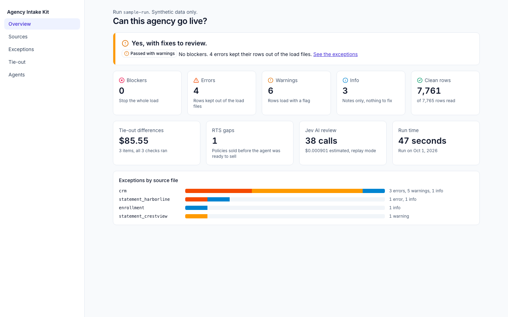
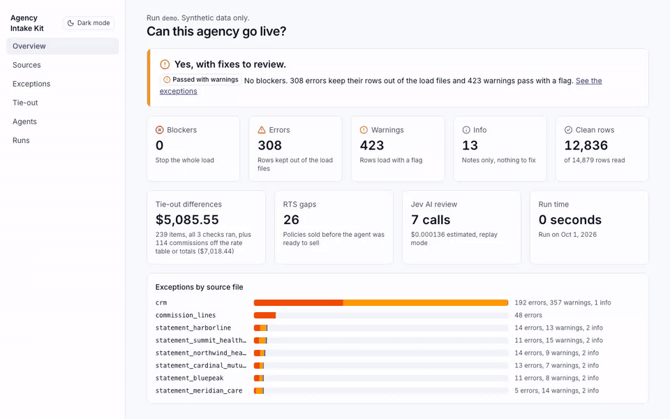
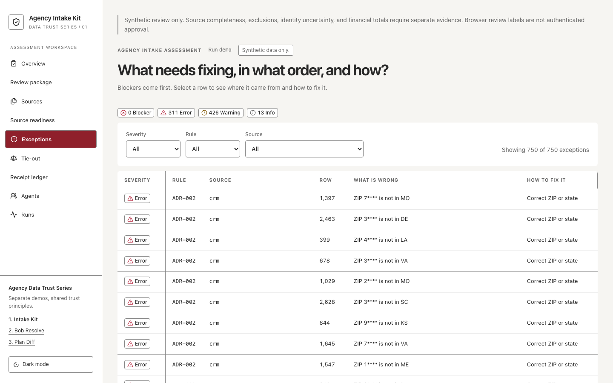
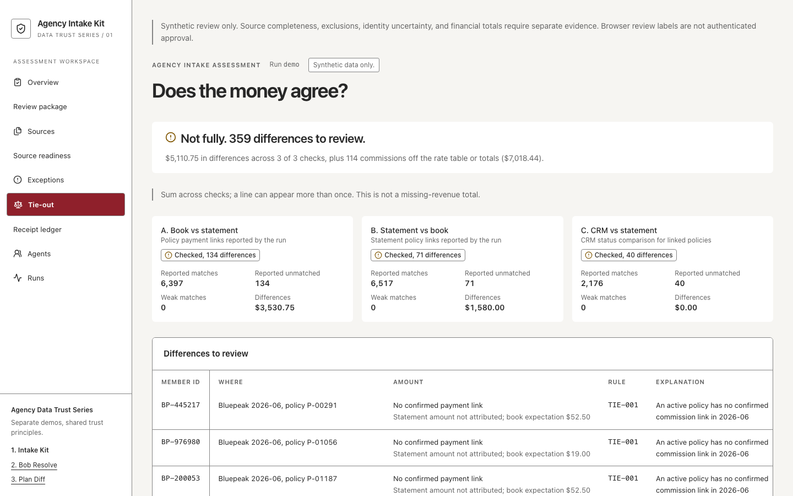
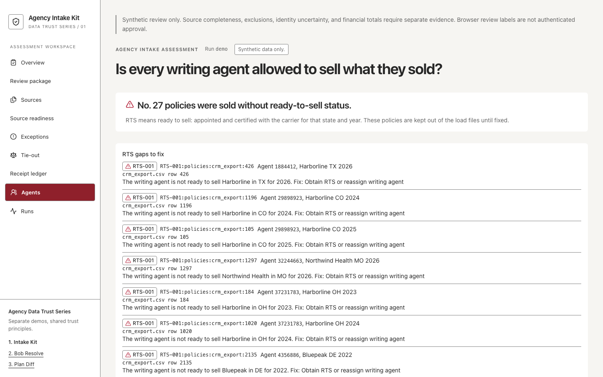

# agency-intake-kit

Validate, reconcile, and show the health of a newly acquired insurance agency's book of business, in one command. All data in this project is synthetic.

**[Open the live demo](https://agency-intake-kit.vercel.app)** · [Walkthrough](docs/demo-walkthrough.md) · [Documentation](docs/README.md) · [Contributing](CONTRIBUTING.md) · [Security and known risks](SECURITY.md)

Start the [three-demo walkthrough](docs/demo-walkthrough.md): [1. Intake Kit](https://agency-intake-kit.vercel.app), [2. Bob Resolve](https://bob-resolve-nine.vercel.app), [3. Plan Diff](https://plan-diff.vercel.app). These are separate working demos with shared trust principles. No client data moves between the sites.

**Result on the synthetic test agency:** all 717 planted mistakes found across 22 scored mistake types (recall 1.00 for every type), with 0 false alarms on 11,234 clean rows (`detection.clean_rows` and `detection.false_positive_rows` in `dashboard/public/demo-run/scorecard.json`). A clean row is one with no planted mistake. Measured on synthetic data, not a real agency.

## Start here

- **Review the product:** follow the [two-minute tour](#two-minute-tour), then the [three-demo walkthrough](docs/demo-walkthrough.md).
- **Inspect the evidence:** the committed [scorecard](dashboard/public/demo-run/scorecard.json), [run manifest](dashboard/public/demo-run/manifest.json) and [end-to-end assertions](engine/tests/e2e/test_agency_a.py) make the result reproducible. See [benchmark methodology and caveats](docs/benchmark-header-mapping.md) for the separate header-mapping experiment.
- **Run or contribute:** use the [locked quickstart](#run-it-in-five-commands) and [contributor checks](CONTRIBUTING.md). No API key is required in replay mode.
- **Understand the boundary:** this is a synthetic-data recruiting demo. [Honest limits](#honest-limits) and [SECURITY.md](SECURITY.md) describe what has not been validated. The broader roadmap remains deferred.

## Architecture at a glance

- `engine/`: Python 3.12 CLI, schema validation, deterministic rules and DuckDB reconciliation. Jev handles bounded gaps; it never changes a rule verdict.
- `fixtures/`: seeded synthetic inputs and ground truth. `engine/tests/` verifies rules, raw safety gates and the end-to-end demo.
- `runs/`: local immutable run directories containing manifests, lineage, exceptions, clean outputs and reports. These generated runs are ignored by Git.
- `dashboard/`: Next.js 16 and React 19 presentation of committed synthetic run files. Browser-selected Runs packages stay in the browser; there is no production account or upload service.
- `docs/`: [design decisions](docs/adr/README.md), data contracts, evaluation caveats and the walkthrough. The root package coordinates development and verification scripts and intentionally has no dependencies or lockfile.

Canonical locks are `engine/uv.lock` and `dashboard/package-lock.json`. The public dashboard and local CLI are separate surfaces; the [threat boundaries](SECURITY.md#threat-boundaries) apply to both.





## Two-minute tour

1. Open the [live demo](https://agency-intake-kit.vercel.app), which starts on the Overview page.
2. Read the answer at the top: "Yes, with fixes to review," with 0 blockers, 311 errors, and 426 warnings.
3. Open Exceptions to see every problem sorted by severity, with its rule and source file.
4. Click any row to open the drawer, which shows the suggested fix and the exact file, sheet, and row the problem came from.
5. Open Tie-out and find the $61.05 that Harborline paid in August for a member who is on no policy in the book.

## What this is

When an insurance agency is bought, its records arrive as a pile of mismatched files: a CRM export, an enrollment platform export, carrier commission statements, and an agent roster kept by hand. Someone then checks them by hand for weeks, and nothing downstream, human or AI, can act on data nobody has checked. This kit takes that pile and, in one command, answers three questions: can this book go live in our systems, does the money agree, and was every policy sold by an agent allowed to sell it.

- **Reads the files as they come**, with odd encodings, title rows, total rows, and Excel dates.
- **Maps columns to one standard format**: a dictionary first, then Jev, then a person.
- **Checks every row against 46 named rules**, each with a severity and a suggested fix.
- **Reconciles the money three ways in SQL**: the book, the carrier statements, and the CRM.
- **Shows what to fix first** on a dashboard and in a one-file HTML report.

## Why this exists

I am Alex Munzon, a UCLA business economics student. I built this as a working answer to a question I kept running into while studying insurance agency acquisitions: when an agency changes hands, how do you know its data can be trusted? This kit is the job of an AI deployment specialist written as code. It makes the checks explicit, scores them against planted mistakes with known answers, and keeps a person in charge of every judgment call. I wrote the spec, chose every rule and threshold, and reviewed and approved every change. AI coding agents did the typing, one pull request at a time against that spec, with tests written first and every check run in CI before a merge. The commit history shows which commits they co-authored. If you want to see how I think, start with [SPEC.md](SPEC.md) and the five decision records in [docs/adr/](docs/adr/README.md).

## Who it is for

- **Agency owner or acquirer:** one answer, can this agency go live, and if not, why not.
- **Integration specialist:** every problem, how serious it is, the exact source row, and how to fix it, in priority order.
- **Finance or M&A analyst:** commission differences in dollars by carrier and agent.
- **Compliance lead:** which agents wrote business they were not ready to sell or licensed for.

## Results (synthetic)

From the committed demo run of the synthetic agency (`dashboard/public/demo-run/scorecard.json`, made by `npm run demo`). Status: **passed with warnings**. 14,879 rows read, 12,833 clean and ready to load. 0 blockers, 311 errors (rows held out of the load files), 426 warnings (rows load with a flag), 13 info notes.

Recall is the share of planted mistakes the kit found. A false alarm is a problem raised on a row with no planted mistake. The end-to-end test fails, and so does every check, if recall drops below 0.95 for any type or false alarms rise above 0.5 percent (`engine/tests/e2e/test_agency_a.py`).

| Mistake planted | Rule | Planted | Found |
|---|---|---|---|
| Unpaid active policy | TIE-001 | 131 | 131 |
| Payment for no policy | TIE-002 | 68 | 68 |
| Commission off the rate table | TIE-003 | 66 | 66 |
| Messy status word | STA-001 | 52 | 52 |
| Statement total off by more than 0.5 percent | TIE-005 | 48 | 48 |
| CRM status disagrees with the carrier | TIE-004 | 40 | 40 |
| Missing Medicare number | MBI-003 | 40 | 40 |
| Policy sold without ready-to-sell status | RTS-001 | 27 | 27 |
| Exact duplicate row | DUP-001 | 26 | 26 |
| Personal details in a notes field | PII-001 | 26 | 26 |
| Malformed plan id | PLN-001, 002, 004 | 26 | 26 |
| Status contradicts the dates | DAT-003 | 26 | 26 |
| Invalid Medicare number | MBI-001 | 20 | 20 |
| Same name and birth date on two clients | DUP-002 | 20 | 20 |
| ZIP code in the wrong state | ADR-002 | 20 | 20 |
| Agent not licensed in the policy's state | LIC-001 | 13 | 13 |
| Malformed agent number | NPN-001 | 13 | 13 |
| Policy for a client who does not exist | REF-001 | 13 | 13 |
| End date before start date | DAT-002 | 13 | 13 |
| Writing agent not on the roster | NPN-002 | 13 | 13 |
| Policy id reused with different details | DUP-003 | 8 | 8 |
| Ready-to-sell status had expired | RTS-002 | 8 | 8 |

The tie-out found $5,110.75 in dollar differences across 245 items, plus 114 commissions off the rate table or statement totals ($7,018.44), so the Tie-out page lists 359 differences to review. The generator also plants identity mistakes (name typos, nicknames, swapped birth dates) for the next project, bob-resolve. This kit reports them but does not score them, by design.

## The five dashboard questions

Every page answers its question at the top before showing detail. A check that did not run says "Not checked", never 0, so a missing check can never look clean. A sixth page, Runs, loads a run of your own in the browser (nothing is uploaded). To compare two runs, use `cd engine && uv run intake diff <run_a> <run_b>`.

| Page | Question it answers |
|---|---|
| Overview | Can this agency go live? |
| Sources | Did we receive every file, and did each one read cleanly? |
| Exceptions | What needs fixing, in what order, and how? |
| Tie-out | Does the money agree across the book, the statements, and the CRM? |
| Agents | Did anyone sell something they were not ready to sell? |







Screenshots are made from the demo run by `npm run shots`; more are in [docs/screenshots/](docs/screenshots/).

## Run it in five commands

You need [uv](https://docs.astral.sh/uv/) and Node 24 (for example, installed with [nvm](https://github.com/nvm-sh/nvm)). The engine uses Python 3.12. No API key or environment file is needed for the committed replay demo. Install development dependencies too: Tailwind and TypeScript require them.

```bash
git clone https://github.com/alexmunzon/agency-intake-kit.git && cd agency-intake-kit
(cd engine && uv sync --locked)                 # Python 3.12 and the locked engine
nvm install 24 && (cd dashboard && npm ci)      # Node 24 and the dashboard
JEV_MODE=replay npm run verify                  # lint, types, tests and production build
(cd dashboard && npm run dev)                   # dashboard at http://localhost:3000
```

The dashboard starts with its committed synthetic run. Optionally, `JEV_MODE=replay npm run demo` regenerates that run, replacing `runs/demo` and the committed dashboard demo copy; review the resulting diff. It also writes `runs/demo/report.html` and `runs/demo/clean/`. For a different synthetic drop folder, use `cd engine && uv run intake run --in <drop folder> --out <new run folder> --jev replay`. Never use real client or patient data. Live and record modes require explicit approval and can incur charges. To save a reviewer's mapping decisions from the dashboard for the next run: `cd engine && uv run intake mapping apply <decisions.json> --run <run folder> --in <drop folder>` (details in [docs/jev.md](docs/jev.md#saving-a-reviewers-mapping-decisions)).

## How Jev is used, and what it costs

Jev is TypeSafe's decision model. It answers small, bounded questions (yes or no, or pick one of a list) with a probability instead of free text. It answers four questions here, and only where the rules run out: which standard field a column header holds, which standard value a messy word means, whether a problem looks like a typo or a real business event, and whether a note holds personal details. Below its confidence cutoff, the item goes to a person. **Jev never overrides a rule: rules decide, and Jev only fills gaps and orders the queue.**

- **Cost.** A run of the synthetic agency asks Jev 164 questions (7 to map column headers and messy status words, 157 to triage problems), 70,509 input tokens, an estimated **$0.002961** if paid live (`dashboard/public/demo-run/manifest.json`). Every answer is recorded in the repo, so a replay run, the default, costs $0.
- **Without a key.** Replay mode reads the recorded answers, so the demo, the tests, and CI never call the network. With Jev off, every Jev question goes to the person queue and the run still completes.
- **Spend cap.** A run stops asking Jev when estimated spend reaches $0.50. The rest goes to a person, the run completes, and the manifest records that the cap tripped.

Details: [docs/jev.md](docs/jev.md) and [ADR 0002](docs/adr/0002-jev-as-a-gate-not-a-judge.md).

## Data trust rules

- **No PHI and no real data.** PHI is protected health information, which US law strictly limits. None of it enters the repo, a log, a test, or a model call. Every record is made by a seeded generator, so the same seed always gives the same files.
- **No SSNs, ever.** A file with an SSN column stops the run (rule SSN-001), and a test checks that none of the 25 planted SSN values appears anywhere in the run folder.
- **Lineage on every row.** Lineage is the record of where a row came from: source file, sheet, row number, a fingerprint of the raw row, the run, and the mapping version.
- **Three blockers, no more.** Only three rules can stop a run: a required column is missing (MAP-003), a file has fewer rows than promised (CMP-001), or an SSN column is present (SSN-001). Errors hold their rows out of the load files, warnings pass with a flag, info is logged.
- **Checks before any model.** The SSN and row-count gates run on the raw files before any Jev call. Jev sees only the fields a question needs, and notes pass a personal-details filter first.
- **Runs are never edited.** Each run is a folder that is never changed afterward; a correction is a new run.
- **Money is exact.** Amounts are exact to the cent and written as text, never as approximate decimal numbers.

This is a demonstration of privacy habits, not a HIPAA compliance certification.

## Honest limits

- **Synthetic data, one agency shape.** Every number above comes from one synthetic agency (seed 42: 2,000 clients, 2,600 policies, 25 agents, six fictional carriers). Real agency files will hold mistakes the generator does not make, and the readers know only these four file layouts.
- **A state written as "Tex." is held out of the load files**, even though Jev reads it as TX. The address rule judges the value as the source wrote it, on purpose, so normalizing never hides a messy source. A person decides.
- **Birth dates that differ between the enrollment export and the CRM are counted, not raised.** The demo run compares 1,838 and all agree, but no rule in the catalog turns a disagreement into an exception yet.
- **Not built:** real CRM or carrier connectors, logins on the dashboard, commission math beyond a fixed rate table, the employee benefits line of business, and fuzzy identity matching (that is bob-resolve). See SPEC "Out of scope".
- **Open issues** are public: [github.com/alexmunzon/agency-intake-kit/issues](https://github.com/alexmunzon/agency-intake-kit/issues).

## Header mapping benchmark

How well does each approach turn a messy column header into the right standard field? Refreshed by `cd engine && uv run intake bench header-mapping`.

Read these numbers as a check on a seen set, not accuracy on unfamiliar exports. The 134 headers were written by the builder, and 79 of them come from the fixture files the synonym list was built against. The benchmark asks Jev about the header text and source kind only, with no masked sample values, and uses a single 0.60 cutoff where the pipeline uses 0.60 and 0.85, so it does not match the pipeline's request exactly. Jev runs in replay, which answers only questions it has already recorded, so on a new export an unfamiliar column gets no Jev answer and goes to a person, the same as with Jev off.

<!-- benchmark:start -->
Header mapping benchmark on 134 labeled headers (79 from the fixture files, 55 synthetic variants), Jev in replay. A small seen regression set, not accuracy on unfamiliar exports. Replay sends an unfamiliar column with no recording to a person. Method and caveats in [docs/benchmark-header-mapping.md](docs/benchmark-header-mapping.md).

| Approach | Accuracy | Coverage | Wrong mappings | Not recorded | Model calls | Est. cost per 1,000 headers |
|---|---|---|---|---|---|---|
| Synonyms only | 79.9% (107 of 134) | 71.6% | 0 | 0 | 0 | $0 |
| Synonyms then Jev | 96.3% (129 of 134) | 88.1% | 0 | 0 | 38 | $0.0063 (estimate) |
| Synonyms then Sonnet | skipped: no key | n/a | n/a | n/a | 0 | n/a |
<!-- benchmark:end -->

## More detail

- [SPEC.md](SPEC.md): the contract every change was built against, with the six examples that became tests.
- [CHANGELOG.md](CHANGELOG.md): every pull request, in order. [docs/release-notes-v1.0.0.md](docs/release-notes-v1.0.0.md): what v1.0.0 contains.
- [docs/adr/](docs/adr/README.md): five decision records (DuckDB for the tie-out, Jev as a gate, a static-first dashboard, synthetic data only, separate repos).
- [docs/rules.md](docs/rules.md) (all 46 rules), [docs/schema.md](docs/schema.md) and [docs/outputs.md](docs/outputs.md) (data shapes), [docs/jev.md](docs/jev.md), [docs/synthetic-data.md](docs/synthetic-data.md), [docs/design.md](docs/design.md) (dashboard design), [docs/benchmark-header-mapping.md](docs/benchmark-header-mapping.md).

## Glossary

- **Book of business (BoB):** the list of clients and policies an agency services.
- **RTS (ready to sell):** a broker is licensed, appointed with a carrier, and certified for a plan year in a state.
- **NPN:** National Producer Number, a broker's national ID.
- **MBI:** Medicare Beneficiary Identifier, the number on a Medicare card.
- **Carrier commission statement:** the monthly file a carrier sends listing what it paid the agency per policy.
- **Three-way tie-out:** proof that the book, the carrier statements, and the CRM agree with each other.
- **Jev:** TypeSafe's model that answers bounded questions with a probability.

## Part of a series

This is the first project built in the Agency Data Trust Series. [Bob Resolve](https://bob-resolve-nine.vercel.app) demonstrates conservative identity matching without SSNs; its default synthetic run uses MBI before masking it for display. [Plan Diff](https://plan-diff.vercel.app) compares benefit documents with source/page citations and explicit uncertainty. Each site uses its own frozen run. The broader integration plan remains in [ROADMAP.md](ROADMAP.md).

## License

MIT. See [LICENSE](LICENSE).


## Neutral finance review and receipt ledger (synthetic development candidate)

Classify one complete structured statement with a versioned mapping:

```sh
cd engine
uv run intake finance-review --statement ../fixtures/finance-review/statement.json --mapping ../fixtures/finance-review/mapping.json
uv run intake finance-review --statement ../fixtures/finance-review/statement.json --mapping ../fixtures/finance-review/mapping.json --format csv
```

The example retains renewal revenue of 75.00 after a 25.00 reversal, plus 0.03 unclassified. Category and transaction kind are independent. Unknown labels and missing account codes remain visible. The command prints a neutral review artifact; it does not post entries, claim Campfire compatibility or assign customer/policy identity. JSON is the full statement review including totals; CSV contains scoped source rows for review.

This first slice accepts synthetic structured JSON, not carrier spreadsheets. Approval metadata is declared by the caller, not authenticated; the example approver is synthetic. Invalid amounts, unknown fields, duplicate row IDs and mismatched expected row counts refuse the entire package without partial output. A matching control total checks arithmetic, not finance approval or identity correctness. Source digests are declared provenance, not a verified attachment hash. Do not treat concatenated exports as a ledger: persistent duplicate-delivery and replacement selection, raw-file adapters and dashboard integration are subsequent slices. No real PHI is supported. These are development fixtures, not unseen evaluation or measured operational savings.

The candidate receipt ledger accepts one ordered batch for one carrier and resolves receipts in memory, without a database:

```sh
cd engine
uv run intake finance-ledger --receipts ../fixtures/finance-review/receipts.json --mapping ../fixtures/finance-review/mapping.json
```

It retains every receipt and computes a structured digest from normalized statement evidence. That digest is not a hash of the original file bytes; the caller-provided content hash remains declared provenance. Repeated equivalent receipts are labeled duplicates and add no recognized revenue. Identical legitimate rows within a statement remain separate rows. A correction must explicitly name the current revision it replaces. Superseded revisions stay in receipt history; competing or invalid replacements are reported as conflicts, with conflict amounts separate from active revenue totals.

The ledger is still a development candidate using synthetic structured JSON. The example retains four receipts and yields 85.03 active revenue with 95.03 of competing correction evidence held separately. The Runs finance view accepts single-statement review sidecars, not this ledger envelope. Carrier spreadsheet adapters, durable storage, authenticated finance approval, and a ledger-specific view remain future work.

For future browser testing, use ChatGPT/Codex's in-app browser. Do not launch laptop Chrome, Edge, Chromium or local Playwright browsers. Normal non-browser tests remain required.


### Finance review in Runs

The Runs page displays a separate synthetic statement example with 75.00 renewal revenue after a reversal and 0.03 unclassified. Its arithmetic check does not approve a package or identify a policy. Download its JSON, or add an optional `finance.json` generated by `intake finance-review` alongside the ten existing run files. The finance view displays the attached statement's own agency and period; importing an older run without that file hides the example instead of assigning it to your package. Invalid sidecars refuse the import. Reloading clears the imported package as before. Ledger batch outputs use a different artifact contract and are not accepted as a single-statement sidecar.

### Unresolved evidence from the CLI

Every new `intake run` writes `unresolved_evidence.jsonl` beside the usual files. It contains only schema version, run ID, source, reason and lineage. Reasons are `crm_absent`, `dob_column_missing`, `dob_blank` and `dob_malformed`. When CRM is absent, a source summary has null lineage and received rows retain their original lineage as review references. DOB cases name affected CRM rows with the mapping version. An empty CRM lacking the DOB header has a source summary instead of invented row lineage. No raw identity values or invented customer IDs are exported.

An empty file does not establish readiness: raw blockers suppress evidence, and the manifest and exceptions still determine run status. This artifact does not change clean files or reconcile identities. The dashboard currently skips it; inspect the JSONL alongside the existing run report. Later candidate-link and evidence UI work remains planned.

### Conservative reconciliation links

New runs also write `tie_out/links.jsonl`: one record per checked statement row, with the accepted signed amount, source lineage, candidate policy lineage/methods, explicit state and reason. Only a unique consistent strong identifier confirms a policy link; name/DOB alone is provisional, duplicate/conflicting keys are ambiguous, and no candidate is unmatched. A person with several policies may retain weak alternatives alongside a unique strong match. Confirmation is deterministic attribution, not human approval or verified identity.

Non-confirmed rows keep their dollars in statement totals and unexplained revenue but do not pay a policy or trigger its rate/status checks. Existing six tie-out files remain compatible; `weak_matched` counts confirmed matches only and provisional evidence is in links.jsonl. Dashboard imports currently skip the new artifact. Missing-book runs still report NOT_RUN; this slice does not implement independent absent-book statement totals or change the finance ledger.

Link amounts use the existing tie-out `DECIMAL(12,2)` range. Null is not zero; this slice does not expand that range or add independent diagnosis for out-of-range numeric input. Conservation assertions cover accepted amounts.

Optional `tie_out/links.jsonl` is shown on Tie-out for imported runs, with state counts, candidate/source lineage and 25-row pages. Missing evidence is unavailable, not an all-matched result. Check-variance sums may overlap; net unattributed dollars are already included in statement paid.
