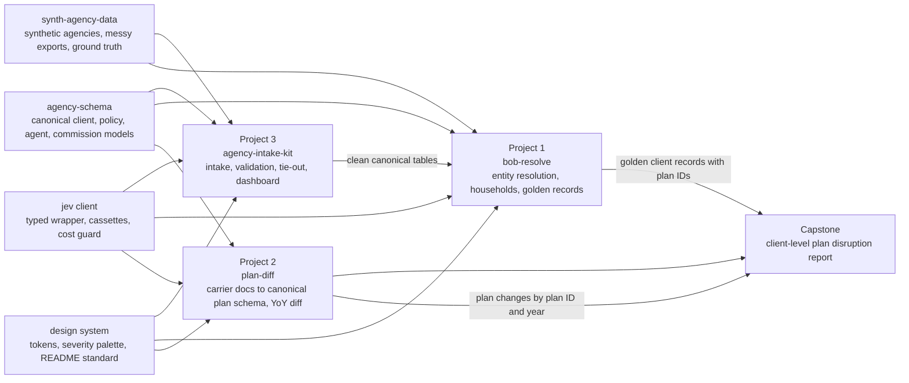

# Agency Data Trust Series: Roadmap

## Bounded conservative matching (2026-10-05)

Reconciliation attributes a policy only when supplied strong keys consistently identify it.
Name/DOB alone stays provisional; conflicting or duplicate candidates remain unresolved.
Carrier-scoped joins preserve separate policies. Signed statement totals remain counted once.
Candidate export and dashboard presentation follow in separate slices.

## Bounded M1 evidence slice (2026-10-05)

PR88 merged at `a347a7f71c4fa8e522ac36725d5423c2a6990a9f` after independent review of `28df8cf7e6efb4e7450bbaabf477aae8a2af8842` and successful hosted run `37384084858`. Local verification passed 846 Python and 138 dashboard tests plus lint/types/build. Production deployment `dpl_9xa2s33a1XoJdMnuAL7DR9PNJw8X` is READY at the merge commit. IAB verified desktop/mobile, an 11-file synthetic failed-run import, unchanged FAILED/no clean/NOT_RUN semantics, reload reset and no observed browser errors or document overflow. This completes the bounded CLI evidence slice only; evidence UI and conservative reconciliation links remain planned.

The CLI writes optional `unresolved_evidence.jsonl` with versioned reason codes and source-row lineage for absent CRM, missing DOB column, blank DOB and malformed DOB. An absent CRM produces a source summary plus references to received rows. These are review references, not customer records, retained raw values or resolved revenue attribution. Raw gate blockers produce an empty evidence file; consult the manifest and exceptions for refusal reasons. Existing FAILED status, clean-output exclusion and NOT_RUN comparisons remain authoritative.

This slice does not add a dashboard evidence view, source readiness workflow or reconciliation candidate states. Existing browser imports continue to skip this optional file. Duplicate identifiers and shared name/DOB reconciliation remain planned. Finance, Bob, Plan and Commons scope remains as recorded below. Delivery requires the local gate, bounded exact-commit review and green exact-head hosted verification.

## Current review ownership (latest user clarification)

The user removed Anne as a delivery dependency and requested continued work. The current demo repair completed a separate, bounded exact-commit independent review. Root arranges independent review of later completed slices. Do not run a broad code audit. Builder tests are not independent review. Green exact-head hosted verification and a no-blocker review remain merge gates. Root is the sole integration owner. M0/demo is complete. The bounded structured-JSON finance core and statement revision ledger are implemented on main. Finance UI PR87 is merged at `4a089c7a63bb03ef01193c75b2ef74de8cfb2c38`, independently reviewed at `426b19f` with hosted run 37381550836 SUCCESS (835 Python, 138 dashboard, lint/types/build). Production deployment `dpl_HXKVvMSqiXWT1AiXsfkR5E3MfWzd` is READY at that merged commit; in-app browser desktop/mobile, exact totals, synthetic 11-file import and reload reset passed with no observed console errors or page overflow.; broader M1, M2 and M4 remain planned. All references below that require Anne specifically are superseded. Bob, Plan and Commons implementation remain paused.

## Current direction and delivery order (2026-10-05)

This amendment controls current goals, acceptance and delivery order. The sections below it preserve the original milestones and historical decisions; their old calendars, review-agent plans, release tags and outreach plans are not current authorization. The expired four-hour deadline is retired. Intake implementation alone is active. Bob Resolve, Plan Diff and Commons implementation remain paused. Documentation updates do not unpause them.

### Latest priority clarification

The user's subsequent instruction changes delivery order: finish and independently review the current Intake demo first, then build a bounded revenue-classification/export slice before broader intake expansion. Current order is M0/demo, finance slice (M3), then M1, M2 and M4. Milestone numbers below are stable scope identifiers, not the current execution order. Parallelize only independent tasks; root remains the sole integration owner. Broader evidence, reconciliation and source-readiness workers were stopped and any saved work must be preserved.

The finance slice must include its own minimal statement identity, duplicate/replacement traceability and conservative attribution contract. It must not require building the whole M1/M2 platform first. Unknown or weak identity stays unresolved; statement-level classification/export can proceed without authoritative customer attribution. Existing M1-M4 acceptance remains the destination. The demo received bounded independent review at exact head `475bc729790777fe3727c793177c4ce714600c79` with no remaining findings. Anne is no longer a delivery dependency.

### Business evidence and product boundaries

User-provided call notes are the basis for this direction, not independently verified transcripts:
- Sam, October 5: data availability and normalization are the bottleneck. Brokers retrieve book exports and statements manually from portals or email. Collect once during diligence, begin integration before close, and reuse through acquisition, onboarding and operations. Accurate book visibility builds trust; measure attributable operational gains.
- George, September 29: CRMs may be absent or unreliable. Identity evidence may be name and DOB or name alone. Insufficient evidence needs the responsible broker; the solution must work across agencies.
- Frederic, September 25: separate new business, renewals, overrides, bonuses and marketing payments for finance reporting. Complement the existing Campfire, Ramp and outside QoE workflow.
- The user's summary of public GYDE materials already includes secure upload, agency/client records, campaigns, meetings, a client-aware copilot and cited plan disruption analysis. These projects supply validation, reconciliation and review outputs for those workflows. No internal GYDE API, vendor import schema or production integration has been verified.

### Goals and verified baseline

| Project | Business outcome | Implemented on main | Saved work and current status |
|---|---|---|---|
| Agency Intake Kit | Collect agency data once before close, preserve incomplete evidence, reconcile and classify it, and produce a reusable, reviewable package for onboarding, finance and broker visibility | `4a089c7`: M0/demo safety repairs, structured-JSON finance classification/export, statement revision ledger and finance view | M0 complete at `54a947f79340dbe90febb3778fd578fe28e18e1e`. Finance core PR85 merged `3308b74`; ledger PR86 merged `78c3696`. Finance UI PR87 is merged at `4a089c7a63bb03ef01193c75b2ef74de8cfb2c38`, independently reviewed at `426b19f` with hosted run 37381550836 SUCCESS (835 Python, 138 dashboard, lint/types/build). Production deployment `dpl_HXKVvMSqiXWT1AiXsfkR5E3MfWzd` is READY at that merged commit; in-app browser desktop/mobile, exact totals, synthetic 11-file import and reload reset passed with no observed console errors or page overflow. Raw carrier adapter and authenticated approval remain planned; full M3 is not complete. M1/M2/M4 planned |
| Bob Resolve | Safely connect cross-source identities, obtain additional evidence when needed, and produce auditable decisions and unresolved cases | `20cc612acc90740bc33938a1b86903d40e710a20`: rules, guard rails, review/apply, provenance and core dashboard | Pagination `2145254`, benchmark UI `61cd4fa`, Jev/LLM and safety commits saved; benchmark, Changes and intake-clean bridge include uncommitted work. Implementation paused |
| Plan Diff | Validate plan-document facts and changes, expose uncertainty, and support broker review in GYDE's existing renewal workflow | `119272ab8f1d6698eb0173f2d3cd0bc4dce8a20c`: extraction, validation, comparisons and dashboard; CI-color repair merged | No-Part-D/trust `48fd212`, labels `9722a2b`, Jev `2e46b87`, LLM branch `7786ae0` plus uncommitted integration saved. Implementation paused |
| Commons dependency | Reusable schemas, synthetic fixtures and replay client | `a9a670fbd9ebced6f2201177d20716fb9944a4c0` | B-seed `6f39a28`, Jev guards `aa48179` and `169c37b` saved in paused worktrees |

Exact worktree heads and dirty-file inventory are in the workspace's `series-docs/RESUME-INVENTORY-2026-10-05.json`. Saved implementation is not a merged or independently approved feature. Preserve all worktrees, including `pd-pr-15/data/raw`. Do not recreate saved features.

### Intake milestone scopes (execution order amended above)

| Milestone | Scope | Acceptance and dependency |
|---|---|---|
| M0: finish safety repair | Complete: input/output path protection, replay-integrity checks, impact score 0 to 2 and bounded RTS matrix rendering | PR84 merged at `54a947f79340dbe90febb3778fd578fe28e18e1e`; independent bounded review at `475bc729790777fe3727c793177c4ce714600c79` found no remaining findings; exact-head hosted run 37367430356 SUCCESS. Production deployment `dpl_X2ouacP8dXTBWLJhovAJRfSoiTC4` READY at the merged commit. Root verified six routes on desktop/mobile, matrix next, impact 1.43 / 2, synthetic 10-file import and reset, with no errors or overflow |
| M1: preserve incomplete evidence and honest attribution | Lineage-preserving unresolved-evidence output, never invented identity or load-ready customers. Links explicitly confirmed, provisional, ambiguous or unmatched; candidate evidence and unresolved dollars remain visible | After the finance slice: absent CRM, missing DOB column, blank DOB, malformed DOB, duplicate member IDs and two policies sharing name/DOB have explicit outcomes. No smallest-policy-ID selection, no weak name/DOB confirmation, no lost or double-counted money. Valid statement totals remain usable independently; SSN and truncation protections remain |
| M2: pre-close source readiness | Expected sources by agency, carrier, file type and period; received time, source as-of, owner, collection status and next action. Missing, stale, duplicate and corrected deliveries; idempotent imports and traceable revisions | After M1: synthetic missing statement, stale statement and duplicate identified correctly; duplicate changes no totals; move package into onboarding without re-upload. Extend run outputs/views. Portal/email fixture adapters demonstrate boundaries only, no live carrier login automation |
| M3: finance classification and export | Revenue category separate from transaction kind. Categories: new business, renewal, override, bonus, marketing, unclassified. Kinds: payment, reversal, adjustment. Retain original labels, mapping version, source rows and classification method | Bounded structured-JSON core and ledger implemented: PR85 merged `3308b74`, independently reviewed `9a32d6e`, hosted run 37379197097 SUCCESS (806 Python, 105 dashboard); PR86 merged `78c3696`, independently reviewed `d4ff3d`, hosted run 37380145559 SUCCESS (835 Python, 105 dashboard). Raw carrier adapter and authenticated approval remain planned. Mapping approval metadata is declared provenance, not authenticated authorization. Finance UI PR87 is merged at `4a089c7a63bb03ef01193c75b2ef74de8cfb2c38`, independently reviewed at `426b19f` with hosted run 37381550836 SUCCESS (835 Python, 138 dashboard, lint/types/build). Production deployment `dpl_HXKVvMSqiXWT1AiXsfkR5E3MfWzd` is READY at that merged commit; in-app browser desktop/mobile, exact totals, synthetic 11-file import and reload reset passed with no observed console errors or page overflow. Full M3 remains incomplete. Acceptance: exact totals by agency/carrier/period/category. Categorized plus unclassified equals statement totals; renewal chargeback keeps category and signed amount; unknown labels stay unresolved. Corrections create revisions, duplicate imports add no revenue. Neutral review export and configurable account mapping only, no invented Campfire schema or journal posting |
| M4: operational readiness and broker visibility | Separate pipeline success from a person's package approval. Show source coverage/freshness, accepted/excluded/unresolved counts, enrollments by carrier, known people, unresolved identities, revenue, owners and reasons | After bounded M3 and broader M1/M2: deterministic severity/load rules remain authoritative. Jev can assist mapping/priority but never override blockers or release a package. Weak/conflicting identity never becomes authoritative finance attribution; source freshness is distinct from record update time |

A dependency on Bob, Plan or Commons becomes a documented adapter contract or unresolved dependency, not permission to edit those implementations.

### Future Bob amendments (planned, paused)

Extend existing review/apply with needs-evidence status, responsible broker, requested information and response provenance. A recorded decision is not necessarily a resolved conflict. Suggested same-person pairs are not completed human review. Report automatic precision/coverage, unresolved rate, actual confirmed resolution, reviewer time and broker follow-ups, stratified by available identifiers. Preserve the no-name/DOB-only-auto-merge rule. Reuse saved pagination, seed, benchmark and bridge work after explicit resumption and independent review; do not rebuild it.

Acceptance: name-only and name/DOB-only cases remain unresolved without additional evidence; broker response provenance is retained; unresolved conflicts stay open even after a decision is recorded. First reconcile saved branches, then evidence workflow and metric semantics, then benchmark on frozen data. Model agreement/confidence is not correctness and an LLM rationale adds no missing identity evidence.

### Future Plan amendments (planned, paused)

Reuse saved trust work. Preserve no-Part-D, not applicable, extraction missing, conflicting and incomparable states separately, with shared-benefit and comparison context. Evaluate unseen documents without first tuning on them; the existing Texas tuned slice is development evidence, not unseen accuracy. Later, add a small synthetic enrollment-to-plan-change broker worklist with explicit county evidence, citations and review status. Unknown identity, county or plan stays unresolved; this is never a coverage-suitability determination.

Dependency order: reconcile saved trust/no-Part-D work, verify state semantics and frozen unseen evaluation, then consider the synthetic worklist after upstream identity and county contracts exist. No new carrier downloads are authorized.

### Verification, review and delivery

One integration owner, small coherent slices, meaningful regression tests and no competing full suites. No broad code audit. Separate bounded independent review is allowed; Anne is not a delivery dependency. Root arranges review of completed slices. Each slice supplies branch, exact commit, diff scope, test results, limitations and special-review points; do not certify builder checks as independent review. No merge or deployment of new unreviewed changes.

Measure manual effort, repeated requests, unresolved items and corrections on the same task and dataset. Distinguish rules-only gains from incremental model gains, synthetic from public-document results, and development fixtures from unseen evaluation. Benchmark models only against measured operational outcomes; do not invent measured savings.

After independent approval and authorized deployment: confirm actual deployed commit, verify desktop/mobile behavior, refresh screenshots and `demo-delivery/DEMO-WALKTHROUGH.md`. Demo: collect once, resolve uncertainty, reconcile revenue, deliver a trusted package. No paid Jev/LLM calls, new carrier downloads, real PHI, team messages, release tags, secret-file reads or security/protection changes.

---

## Historical roadmap (preserved)

Three GitHub projects that prove Alex Munzon can make messy insurance-agency data trustworthy enough for AI agents to act on. Built for recruiting at Gyde (gydehealth.ai), reusable for any forward-deployed, data-ops, M&A analyst, or AI deployment role.

This file is the north star for every Claude Code session on these projects. Read it first in any session. The per-project build guides (starting with `BUILD-GUIDE-agency-intake-kit.md`) carry the step-by-step instructions.

Last updated: 2026-10-04.

---

## 1. Why this exists

**Recruiting goal.** Alex is recruiting on four tracks at once (PM, startups, defense ops, clearance roles). Gyde is the first target where a public GitHub project can do the talking, because the company has named its exact data problems and posted job descriptions that read like a spec. The projects also serve the other tracks: every one of them is a "turn messy operational data into something a business can trust" story, which is the pitch under all four.

**The pitch these projects prove.** Consulting-style structuring plus shipping production software with AI tooling. Most business economics applicants have the first half. These repos are the second half, made visible.

**What a hiring manager should conclude in sixty seconds on the GitHub profile:**
1. He understood our specific problem (entity resolution without SSNs, carrier documents with no standard, agency intake with no reliable CRM).
2. He builds the way we build: deterministic checks first, AI only where rules run out, humans for what neither can settle, provenance on everything.
3. He ships finished things: tests, docs, a deployed dashboard, a benchmark table, a changelog.
4. He already works the way the Deployment Specialist JD describes: SQL and Python for validation and cleanup, Claude Code daily, BI views for reconciliation.

**Who builds it.** Claude Code on Opus 5.5 does the building, one PR per session, following the five-step loop in section 9. Fable does a final sweep per project. Alex owns the spec, reviews every plan, and approves every merge.

---

## 2. The target: Gyde

Full brief lives in the Recruiting project (`gyde-research-and-project-ideas.md`). The parts that shape the build:

**Company.** AI-native health insurance brokerage, Austin and NYC. Launched January 28, 2026 with $60M led by Lightspeed; Optum Ventures, Crystal Venture Partners, Virtue, MVP Ventures participated. CEO Will Johnson, COO Sam Wiener. Team pedigrees: Oscar Health, Stripe, Duckbill, Vista, Alpine. Model: acquire Medicare Advantage, ACA/Individual, and Employee Benefits agencies, keep the teams, layer on GydeOS (broker OS), Gia (AI assistant for SMS, voice, plan Q&A grounded in carrier documents with page citations), and AiMS. Seven acquisitions in seven months. Renewals AI shipped September 1, 2026 with per-client plan disruption analysis.

**The person.** George Quievryn, Founding Engineer, ex-Oscar Health, leads the non-LLM and ETL work. He is the audience for the technical depth. The AI Deployment Specialist hiring manager is the audience for project 3's README.

**The problems George named (Alex's call notes).**
- No standardization of medical plan data across carriers (Aetna vs Cigna, 300-page benefit documents).
- Agencies lack reliable CRMs. Data arrives from agencies, carriers, spreadsheets, CRMs, PDFs, manual processes.
- Entity resolution on name plus DOB because no SSN exists across sources; also addresses, emails, policies, households. Ambiguous matches need human escalation.
- Validation, anomaly detection, provenance, and versioning are all needed.
- AI helps with intake but does not remove deterministic checks or human review.
- Goal: data trustworthy enough for downstream AI agents.
- Scale per the call: roughly 500,000 clients and 8,000 brokers after a year (public number is 100,000+ clients; the 500k likely counts the downline hierarchy).

**The roles that matter (Greenhouse, October 2026).**
- AI Deployment Specialist / Partner Success Specialist, $125k to 145k OTE, Austin or NYC, 25% travel. Owns GydeOS stand-up at each acquired agency within 30 days of close: book-of-business and ready-to-sell uploads (validating, cleaning, troubleshooting), CRM integration, commissions and contracting configuration, reconciliation dashboards, SQL and Python, Claude Code daily. Asks for 4+ years. Project 3 is this JD as code.
- M&A Analyst, $100k to 120k plus equity, 1 to 3 years. Turns messy seller books and carrier commission statements into clean numbers, reconciles statements line by line. The cleanest resume fit today. Project 3's tie-out engine is this JD's core skill.
- AI Engineer, $175k to 250k, 3+ years leadership. Integration targets named: AgencyBloc, Sunfire, HealthSherpa, Ideon. Projects 1 and 2 speak to this org.

**Timing that matters.** Medicare Annual Enrollment runs October 15 to December 7 and ACA Open Enrollment runs November 1 to January 15. Gyde will be heads-down. Plan a short, no-reply-needed note to George when project 3 ships, and the fuller conversation after December 7. Alex graduates December 10 and reconnects with Colin McDonnell (Lattice) around then; the same three repos serve that conversation.

---

## 3. The thesis (what every README says in its own words)

Operational data in insurance distribution is a pile of exports nobody trusts. The fix is not a bigger model. It is a layered trust architecture:

1. **Deterministic floor.** Schema, format, referential, and date logic checks that never guess. They set the minimum.
2. **Jev gate.** TypeSafe AI's Jev decision model answers bounded questions (yes/no with a probability, pick one of N with a confidence, score on a rubric). At TypeSafe's published pricing (about four cents per million input tokens, output free, as of October 2026) a decision should cost a fraction of a cent, and the docs describe sub-second responses; every project measures both and reports them rather than repeating the claim. It fills the gaps rules cannot classify: which canonical field is this column, is this status value "terminated", is this exception a typo or a real event, are these two records the same person.
3. **Reasoning model for the gray zone only.** Sonnet or Opus runs only where Jev's confidence is low, and always writes a rationale a human can read.
4. **Human queue as a first-class product.** Whatever neither could settle lands in a queue with severity, context, suggested fix, and the evidence that got it there.
5. **Provenance and versioning on everything.** Every output row knows its source file, sheet, row, raw hash, and run. Runs are immutable. Corrections are new rows. Completeness is asserted (expected versus received counts) or the run fails loudly.
6. **A dashboard a non-engineer can read.** Agency owners and Gyde leadership see integration health at a glance.

Jev's role is a gate, never a judge of last resort, and it never overrides a deterministic verdict. That sentence, or one like it, belongs in every README.

---

## 4. Build order and how each project feeds the next

**Project 3 first (agency-intake-kit).** It is the Deployment Specialist JD turned into code, it reuses the three-way tie-out shape Alex already owns from Suited AI, and it is the easiest to make look finished. It also forces the shared foundations into existence: the canonical schema, the synthetic data generator, the Jev client, and the dashboard design system all get built here and extracted later.

**Project 1 second (bob-resolve).** It consumes project 3's clean canonical tables as input. Project 3's generator already injects identity mess (nicknames, name typos, DOB transpositions, near-duplicate clients) but marks it unscored, because project 3 only catches exact collisions; project 1 is where that mess gets scored, and it extends the generator with harder cases (maiden names, moved households, shared contact details, a child on a parent's policy). The Jev client gets its most important use: the "same person?" gate. This is the problem George led with.

**Project 2 third (plan-diff).** Independent of the other two in code, dependent on them for narrative: project 3 proves intake, project 1 proves identity, project 2 proves content. Uses public plan documents and CMS public use files only. Reuses the Jev client (document classification, extraction agreement checks) and the design system.

**Capstone demo.** Join project 1's golden client records (which carry plan IDs) to project 2's plan-level year-over-year changes and produce a client-level disruption report: which clients are on a terminated plan, which lost a service area, whose copays rose. That is the shape of Gyde's Renewals AI output, built from the ground up on synthetic clients and real public plan data. The capstone is a single README section with one screenshot and one notebook, not a fourth repo.

**Repository strategy.** Three separate repos, each pinned on the GitHub profile with its own README, because three finished repos read better than one monorepo. Project 3 contains the shared packages (`agency_schema`, `synth_agency_data`, `jev_client`) as installable sub-packages. When project 1 starts, its PR 0 extracts them into a fourth, unpinned repo `agency-data-commons` that projects 1 through 3 all depend on. That extraction is a real engineering story in itself (versioning, semantic releases) and it keeps each project README focused.

---

## 5. Project 3: agency-intake-kit

**One line.** The 30-day stand-up toolkit for a newly acquired agency: take whatever an agency hands over, map it to a canonical book of business, validate every row, reconcile it three ways against carrier commission statements and the CRM, and show integration health on a dashboard an agency owner can read.

**Business outcome it simulates.** The AI Deployment Specialist KPI "time to complete systems integration within 30 days of close," plus the M&A Analyst skill "reconcile a carrier commission statement line by line."

**Inputs (all synthetic).** Four source shapes per agency: a CRM export in an AgencyBloc-style CSV, an enrollment-platform export in a Sunfire-style CSV, carrier commission statements as XLSX (one per carrier, each with its own layout), and a hand-kept agent roster spreadsheet with ready-to-sell (RTS) status. Each with its own header names, date formats, encodings, trailing total rows, and mistakes.

**Outputs.** An immutable run directory: `manifest.json` (input hashes, versions, timings, Jev usage and cost), `scorecard.json`, `mapping/*.yaml` (learned column maps, reused next time), `exceptions.jsonl` (rule id, severity, lineage, suggested fix, blocks-load flag), `tie_out/` (variances with reason codes, totals by carrier and agent), `clean/` (load-ready CSV and Parquet), and `report.html` (self-contained static report). The Next.js dashboard renders the same JSON.

**Scope.**
- In: file ingest with sniffing; column mapping (synonyms, then Jev, then human); 46 deterministic rules with stable IDs (catalog in the build guide); cross-record checks (duplicates, orphans, RTS compliance, license coverage); three-way tie-out in DuckDB SQL; exceptions queue with Jev triage and a PII gate; completeness assertion; CLI; static report; dashboard with Overview, Sources, Exceptions, Tie-out, Agents; run diff; benchmark of header mapping (synonyms vs synonyms plus Jev vs Sonnet).
- Out: real CRM API connectors (no credentials, no vendor formats claimed), commission math beyond a fixtures rate table, any LLM-written content in the load files, user accounts or auth on the dashboard, anything that stores PHI.

**Success criteria.**
- On the default synthetic agency (seed 42, 2,000 clients), every injected defect class is detected with precision and recall reported in the README, and the clean world produces zero exceptions above info.
- `npm run verify` passes on every merge; CI green; dashboard deployed on Vercel from `main`.
- A reader with no context understands the problem, the architecture, and the result from the README in under two minutes.
- Header-mapping benchmark table published with accuracy, cost per 1,000 headers, and p50 latency for each approach.

**Recruiting hooks.** README mirrors the JD's own language (book of business, RTS, commissions and contracting, reconciliation checks, 30 days). Resume line candidates, with placeholders to be replaced by measured numbers from the committed fixtures (the default fixture has 2,600 policies and the catalog has 46 rules): "Built an agency intake pipeline (Python, DuckDB, Jev) validating and reconciling [N] policy records against carrier statements with provenance on every row" and "Shipped a reconciliation dashboard that surfaces [N] classes of data defects with suggested fixes."

**Shared foundations born here.** `agency_schema`, `synth_agency_data`, `jev_client`, the severity palette and dashboard tokens, the README standard, the CLAUDE.md and settings template, the verify command and Stop hook.

---

## 6. Project 1: bob-resolve

**One line.** Entity resolution for agency books of business when no SSN exists: one golden record per person, households clustered, every merge explained, with a Jev-versus-rules-versus-LLM benchmark.

**Why George cares.** It is the problem he named first. The TypeSafe docs even use a duplicate-person example, and as of October 2026 I have not found a published benchmark of Jev as a match gate on insurance-shaped data.

**Inputs.** Project 3's clean canonical tables from two or more synthetic agencies (overlapping clients, because agencies in the same metro share members), plus harder injected identity mess: nicknames (Bill, William, Billy), maiden and hyphenated names, DOB digit transpositions and month-day swaps, moved addresses, shared household phones and emails, a child on a parent's policy, the same policy under two carriers' member IDs.

**Pipeline tiers.**
1. Blocking: deterministic candidate generation (DOB plus name initial, phonetic surname plus ZIP3, exact email or phone, exact policy or MBI).
2. Scoring: probabilistic comparison vectors (Jaro-Winkler on names, DOB edit distance, address normalization, email and phone exact) with a learned or hand-tuned weight set; auto-match above a high threshold, auto-reject below a low one.
3. Jev gate on the gray zone: a `noul` question "Is `record_b` the same person as `record_a`?" with both records passed as structured instructions, plus a `choice` for household role (self, spouse, dependent, unrelated). Thresholds route to auto-merge, LLM, or human.
4. Reasoning model only where Jev is uncertain: Sonnet writes a one-paragraph rationale; Opus only on high-stakes pairs (money or coverage would move).
5. Human review queue with side-by-side records, evidence, and one-click decisions that become training labels.

**Outputs.** Golden records with provenance (which source rows, which tier decided, confidence, timestamp), household clusters, an append-only merge log, a review queue, and the benchmark: precision, recall, F1, cost per 10,000 pairs, p50 and p95 latency for rules alone, rules plus Jev, rules plus Jev plus LLM.

**Dashboard.** Cluster explorer (a household as a small graph), match-decision distribution by tier, review queue, and a "what changed since last run" view.

**Builds on 3.** Reuses schema, generator, Jev client, design system, README standard. Extracts them to `agency-data-commons` in PR 0. Produces the golden records the capstone needs.

---

## 7. Project 2: plan-diff

**One line.** Turn 300-page carrier benefit documents into one canonical plan schema with page-level provenance, then diff plan years to flag the changes that force a client to shop.

**Why Gyde cares.** It is the "no standardization across carriers" problem, and the year-over-year diff is the exact plan disruption analysis Gyde shipped in Renewals AI on September 1 (terminations, service-area reductions, premiums, deductibles, copays, drug coverage, allowances).

**Inputs (all public).** Medicare Advantage Evidence of Coverage and Summary of Benefits PDFs from carrier sites, ACA Summary of Benefits and Coverage PDFs, and CMS public use files (plan benefit and landscape data) as ground truth. Start with two carriers, one state, two plan years; widen only after the pipeline is proven.

**Pipeline.**
1. Document classification with Jev `choice`: carrier, line of business, document type, plan year, before any parsing.
2. Deterministic extraction first: known section headers, benefit tables, cost-sharing grids.
3. LLM extraction only where layout defeats the parser, with the page image or text chunk as input and a strict schema as output.
4. Agreement check with Jev `noul`: does the LLM value agree with the deterministic parse? Disagreements go to review.
5. Per-field confidence `score` so the dashboard shows which fields a broker can trust.
6. Validation against CMS public data; accuracy table published.
7. Year-over-year diff engine keyed by plan ID with change categories and a "shop again" flag.

**Outputs.** Canonical plan records (JSON, Parquet) with document, page, and method on every field; a diff report per plan; the accuracy table; a dashboard with a plan comparison view, a changes-by-category view, and a document viewer that jumps to the cited page.

**Builds on 3 and 1.** Reuses Jev client, design system, README standard. Joined to project 1's golden records (which carry plan IDs) for the capstone.

---

## 8. Shared foundations (build once in project 3, extract later)

**Canonical schema (`agency_schema`).** Pydantic v2 models for Client, Household, Policy, Agent, RtsRecord, CommissionLine, plus enums (LineOfBusiness, PolicyStatus, CommissionType, EligibilityReason; Carrier is an open, normalized string), a `Lineage` type carried by every row, the `ExceptionRecord` model every stage emits, and the rule registry skeleton. Documented in `docs/schema.md` with a field table and the format rules for Medicare Beneficiary Identifiers, National Producer Numbers, Medicare contract-plan IDs, and HIOS plan IDs.

**Synthetic generator (`synth_agency_data`).** Seeded, deterministic. Generates a clean world (people, households, agents with licenses and RTS, policies, commission statements from a fixtures rate table), then applies labeled error injectors at configurable rates and writes the four source shapes with their quirks. Emits `ground_truth.json` so every detector can be scored. Real-looking but fake: Faker names, synthetic MBIs that pass the format check, plan IDs in the right shape with made-up contract numbers.

**Jev client (`jev_client`).** Typed wrapper for `POST https://api.typesafe.ai/v1/systemone` with the three question types, exponential backoff on 429 and 529, usage and cost accounting, a budget guard, and four modes: `live` and `record` (both hit the network and spend money, both need explicit approval), `replay` (cassettes keyed by request hash, used in CI), and `off` (every Jev-dependent step degrades to "unresolved, send to human"). Minimizes payloads: only the fields a question needs, never free-text notes without the PII gate first.

**Design system.** Neutral slate scale, one accent, a severity palette with fixed meaning (blocker, error, warning, info, pass) that is never conveyed by color alone, tabular numerals for IDs and money, dense tables over charts, two chart types only (bars for counts, stacked bars for severity by source), light and dark, 1440 and 375 layouts, keyboard navigable, contrast at least 4.5:1. Documented in `docs/design.md` and reused verbatim across the three dashboards.

**README standard.** Hero screenshot or GIF, three-sentence problem, "what it does" in five bullets, architecture diagram (Mermaid), the trust-layer paragraph, results table (detection rates, benchmark), how to run in three commands, design notes, HIPAA posture (synthetic data only, no PII in logs, redaction, minimization), roadmap link to the other projects, changelog link. Same section order in all three repos.

**Repo hygiene template.** `CLAUDE.md` (commands, gotchas, invariants), `.claude/settings.json` (deny and ask lists, Stop hook that runs the checks), `npm run verify` as the single check, GitHub Actions running it, Vercel linked to GitHub for preview URLs, `CHANGELOG.md`, `docs/adr/` for decisions, `.env.example`, MIT license.

**HIPAA posture (stated, not claimed as certification).** Synthetic or public data only. No PHI ever enters the repo, a log, a test fixture, or a model call. Free text passes a PII gate before any logging. SSN columns are refused by design (rule SSN-001 blocks the load). Payload minimization on every model call. These are the habits a regulated employer wants to see, stated plainly in each README.

---

## 9. Toolchain and process

**Models.** Opus 5.5 in Claude Code builds. Fable runs the final sweep per project (correctness against SPEC, security and PII, performance, README and visual polish) in a fresh session with no build context.

**The loop, per PR.** Documented in full in each build guide. In short: setup once so rules enforce themselves; spec before code (interview with AskUserQuestion, then SPEC.md with outcome, non-goals, files and tables, at least five concrete examples including what must be blocked (project 3 has six), and the end-to-end check); split into PRs under 400 lines, one PR per session per worktree; plan mode with subagents, edit the plan until it could be explained to a client; build test-first with the failing tests written from SPEC examples, run `npm run verify` and show output, screenshots at 1440 and 375 for UI; review with fresh eyes against SPEC in a new context, check the preview URL, open the PR, merge, delete the worktree, update the changelog; only then the next PR.

**Alex's standing build rules (from his own process).** Use subagents for investigation. Keep context under 40 percent; `/clear` and restart with a better prompt after two failed corrections. Never let the model that wrote the code be the only reviewer of that code. Define success with three to five real examples including what should be blocked before any code exists. Plain language in docs; explain a technical term in two sentences the first time.

**Stack decisions (locked for the series).** Python 3.12 with uv for the engine (polars, duckdb, pydantic v2, typer, rich, httpx, openpyxl, faker, pytest, hypothesis, ruff, mypy). DuckDB SQL for reconciliation views, because the JD says SQL plus a BI tool and because the tie-out reads best as SQL. Next.js (App Router, TypeScript, Tailwind, shadcn/ui, TanStack Table, Recharts, next-themes) for the dashboard, deployed on Vercel. The dashboard is static-first: it renders a committed demo run so every preview URL shows a full result, and it can load another run's JSON entirely client-side. Playwright for screenshots. GitHub Actions for CI.

---

## 10. Timeline against Alex's calendar

Alex is in Madrid until about October 20, then Los Angeles. His 12-week plan has Tuesday and Thursday build blocks; add weekend blocks when the Stanford Thursday class allows. Two PRs per block is realistic with Claude Code once setup and spec are done.

| Window | Project 3: agency-intake-kit | Recruiting beat |
|---|---|---|
| Oct 6 to 12 | Setup, SPEC session, PRs 1 to 5 (schema, generator, injectors, readers, synonym mapping) | Nothing outbound. AEP starts Oct 15 |
| Oct 13 to 19 | PRs 6 to 11 (Jev client, Jev mapping, validators, cross-record checks, tie-out, exceptions) | Draft the LinkedIn post skeleton |
| Oct 20 to 26 | PRs 12 to 15 (CLI and run orchestration, tag v0.1.0 when the engine is complete, dashboard shell, Sources and Exceptions pages, Tie-out and Agents pages) | Back in LA |
| Oct 27 to Nov 2 | PRs 16 to 18 (upload, run diff, benchmark, README, screenshots, GIF), Fable sweep, tag v1.0.0 | Short note to George: "built this after our call, no reply needed until after AEP." LinkedIn post. Resume line updated |
| Nov 3 to 30 | Project 1: bob-resolve (PR 0 extracts commons; ~16 PRs) | Second LinkedIn post. Keep Colin warm |
| Dec 1 to 10 | Project 2: plan-diff first vertical slice (two carriers, one state, two years) plus capstone section | Dec 7 AEP ends. Fuller note to George with all three. Dec 10 graduation and Colin reconnect |
| Dec 11 to Jan 15 | Finish plan-diff; capstone polish; profile README | Apply or ask for a junior deploy-and-drive seat; M&A Analyst application if still open |

If a week slips, cut from the end of each project (run diff, benchmark extras, extra dashboard views), never from tests, provenance, or the README.

---

## 11. Publishing and outreach

**GitHub profile.** Pin the three repos (and later `agency-data-commons`). Profile README: one paragraph in Alex's voice about building trust layers for messy operational data, the three repo cards, a line about Lyve and Suited AI as production context, contact. No em dashes anywhere; it is a house rule.

**Each repo.** Follows the README standard in section 8. Hero image is a real screenshot of the deployed dashboard. One 20-second GIF of the CLI run and the dashboard refresh. Releases tagged (v0.1.0 when the engine or core pipeline is complete, v1.0.0 when the dashboard, README, and sweep are done). Issues used as a public roadmap, including "known gaps" so nothing is overclaimed.

**LinkedIn.** One post per project when it ships: the problem in two sentences, one screenshot, one number from the results table, the link. Colin's advice: publish outcomes, label scoped versus shipped work accurately.

**The note to George (early November).** Four sentences. You mentioned agencies arrive with no reliable CRM and intake is where trust is won or lost. I built a small intake kit after our call: validation, three-way tie-out against carrier statements, Jev as a cheap gate for column mapping and triage, provenance on every row. Link. No reply needed during AEP; I would love fifteen minutes after December 7 to hear where it is naive.

**The note after AEP (December).** Projects 1 and 2 plus the capstone, and the direct ask: is there a junior deploy-and-drive or data-ops seat, or should he apply to M&A Analyst.

**Resume.** One line per project once numbers exist, 107 to 115 characters, Built or Shipped only for what Alex personally directed and tested, no overclaiming.

---

## 12. Risks and rules

- **No PHI, ever.** Synthetic or public data only. The generator is the only data source for projects 1 and 3. Project 2 uses public documents. If a real file ever lands on the machine for any reason, it never enters the repo, a fixture, a log, or a model call.
- **No vendor impersonation.** Source formats are "AgencyBloc-style," "Sunfire-style." Never claim to parse a vendor's real export unless a public spec exists.
- **Jev stays optional.** Every Jev-dependent step has an `off` mode that degrades to the human queue. CI runs in `replay` mode. No API key in the repo. Budget guard on every run.
- **Do not overclaim.** Detection rates are measured on synthetic ground truth and labeled as such. The README says what is not handled.
- **Scope discipline.** The PR plan is the scope. New ideas go to Issues, not into the current PR.
- **Keep it readable.** Alex is not an engineer by training and the hiring managers for two of the three target roles are not either. Plain-language docs, a glossary in each README, comments where a rule encodes a domain fact.
- **Two failed corrections means stop.** `/clear`, write down what was learned, restart with a better prompt.

---

## 13. Definition of done, per project

- SPEC.md examples all pass as tests; `npm run verify` green on `main`; CI green; deployed on Vercel.
- README follows the standard with real screenshots and a results table measured on the committed fixtures.
- CHANGELOG lists every PR. ADRs exist for the decisions a reviewer would question (why DuckDB, why Jev as a gate, why a static-first dashboard, why synthetic data only, why separate repos).
- Fable sweep completed; its findings fixed or filed as Issues with honest labels.
- A release tagged, a LinkedIn post drafted, the resume line candidate written.
- The vault updated: a Gyde entity page, a project hub page, a log entry.
